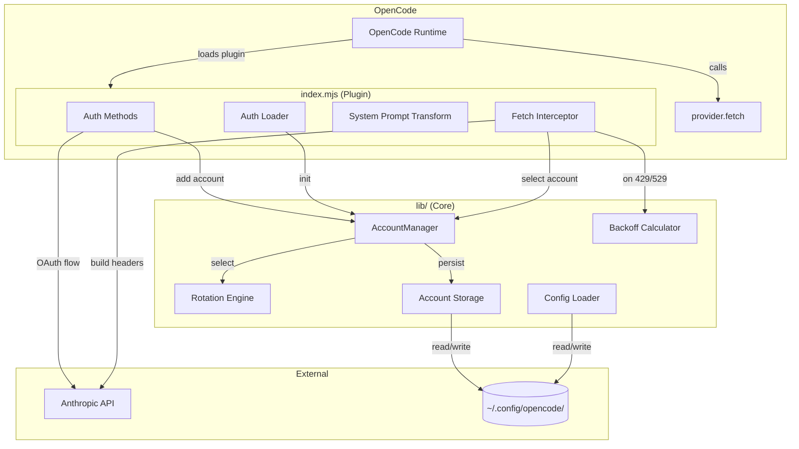
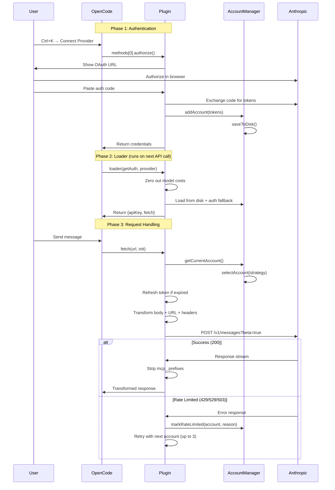
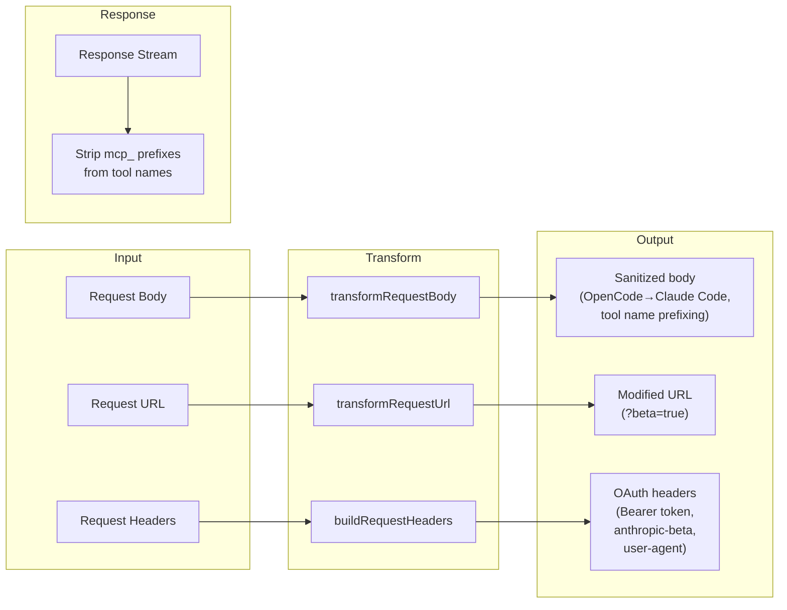
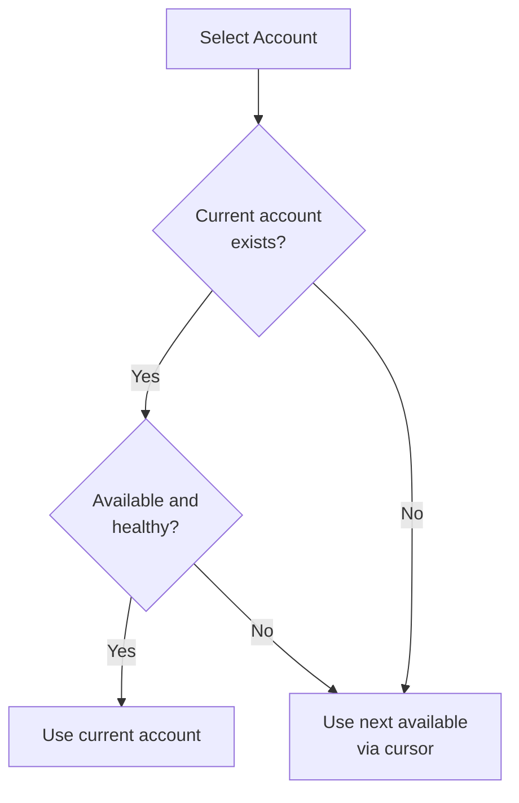
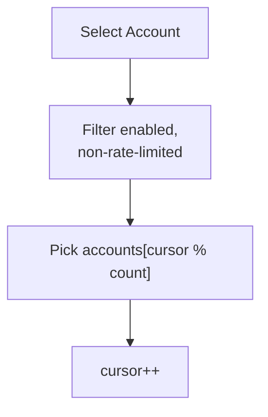
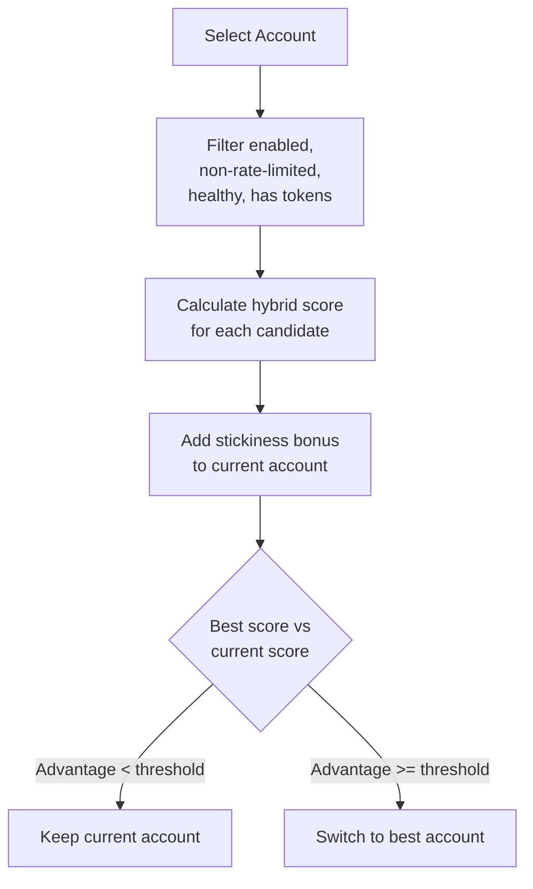
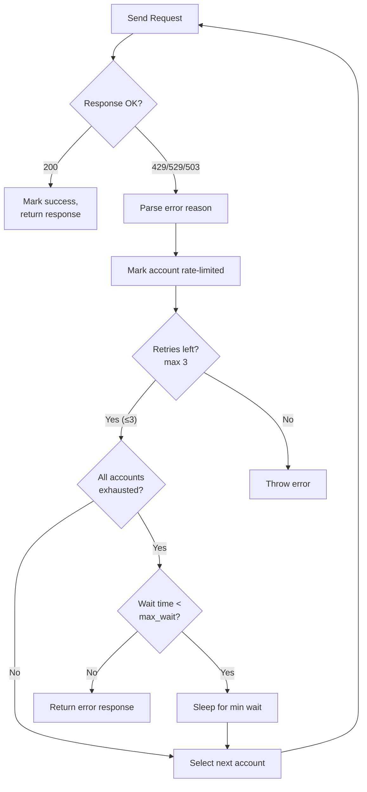

# Contributing

This document covers the architecture, implementation details, and development workflow for the multi-account fork of `opencode-anthropic-auth`.

## Development Setup

```bash
git clone https://github.com/rmk40/opencode-anthropic-auth.git
cd opencode-anthropic-auth
npm install
npm run install:link   # Symlink plugin + CLI for live development
npm test               # Run all tests (~2s)
```

### Running Tests

```bash
npm test               # Single run
npm run test:watch     # Watch mode
```

Tests use [vitest](https://vitest.dev/). All modules are tested in isolation with mocked dependencies.

## Project Structure

```
opencode-anthropic-auth/
  index.mjs              Plugin entry point (OAuth flow, fetch interceptor, retry loop)
  index.test.mjs         Plugin integration tests
  cli.mjs                Standalone CLI (11 subcommands)
  cli.test.mjs           CLI command tests
  package.json           Dependencies: @openauthjs/openauth (prod), vitest (dev)
  lib/
    accounts.mjs         AccountManager class (pool management, selection, persistence)
    accounts.test.mjs    AccountManager tests
    rotation.mjs         HealthScoreTracker, TokenBucketTracker, selectAccount()
    rotation.test.mjs    Selection algorithm tests
    backoff.mjs          Rate limit parsing, backoff calculation
    backoff.test.mjs     Backoff calculation tests
    config.mjs           Config loader/saver, validation, env overrides
    config.test.mjs      Config loading/validation tests
    storage.mjs          Account persistence (atomic writes, deduplication)
    storage.test.mjs     Storage persistence tests
  scripts/
    install.mjs          Unified installer (link/copy/uninstall)
```

## Architecture Overview



## Plugin Lifecycle

The plugin integrates with OpenCode through three hooks:



## Request Transformation Pipeline

Every API request goes through a multi-stage transformation:



### Body Transformations

| Step                       | What                                                                                                           | Why                                          |
| -------------------------- | -------------------------------------------------------------------------------------------------------------- | -------------------------------------------- |
| System prompt sanitization | Replace "OpenCode" with "Claude Code", "opencode" with "Claude" (preserves paths like `/path/to/opencode-foo`) | Anthropic's API blocks the string "OpenCode" |
| Tool definition prefixing  | Add `mcp_` prefix to `tools[].name`                                                                            | Required by Anthropic's OAuth API            |
| Tool use prefixing         | Add `mcp_` prefix to `tool_use` blocks in `messages[].content`                                                 | Matches the tool definition prefixes         |

### URL Transformations

| Step      | What                                  | Why                         |
| --------- | ------------------------------------- | --------------------------- |
| Beta flag | Append `?beta=true` to `/v1/messages` | Enables OAuth beta features |

### Header Transformations

| Step             | What                                               | Why                            |
| ---------------- | -------------------------------------------------- | ------------------------------ |
| Authorization    | `Bearer <access_token>`                            | OAuth authentication           |
| Beta headers     | `oauth-2025-04-20,interleaved-thinking-2025-05-14` | Required beta features         |
| User agent       | `claude-cli/2.1.2 (external, cli)`                 | Identifies as Claude CLI       |
| Remove x-api-key | Delete if present                                  | OAuth uses Bearer, not API key |

### Response Transformations

| Step           | What                                         | Why                          |
| -------------- | -------------------------------------------- | ---------------------------- |
| Strip prefixes | Remove `mcp_` from `"name"` fields in stream | Undo the tool name prefixing |

## Account Selection Engine

### Strategy: Sticky (Default)



Stays on one account until it fails or is rate-limited. Best for single-account use.

### Strategy: Round-Robin



Rotates through accounts on every request. Spreads load evenly.

### Strategy: Hybrid



**Hybrid score formula:**

```
score = (healthScore × 2) + ((tokens / maxTokens) × 500) + min(secondsSinceUsed, 3600) × 0.1
```

- **Health component** (0-200): Rewards reliable accounts
- **Token component** (0-500): Prefers accounts with available rate limit budget (`tokens / maxTokens` ratio scaled to 0-500)
- **Freshness component** (0-360): Slight preference for less recently used accounts
- **Stickiness bonus** (+150): Added to current account to prevent unnecessary switching
- **Switch threshold** (100): Must beat current by this much to trigger a switch

### Health Score System

Each account has a health score (0-100) that tracks reliability:

| Event              | Score Change |
| ------------------ | ------------ |
| Successful request | +1           |
| Rate limited       | -10          |
| General failure    | -20          |
| Passive recovery   | +2 per hour  |

Accounts below `min_usable` (default: 50) are skipped by the hybrid strategy.

### Token Bucket Rate Limiting

Client-side rate limiting prevents sending requests to accounts that are likely to be rate-limited:

| Parameter                      | Default | Description                      |
| ------------------------------ | ------- | -------------------------------- |
| `max_tokens`                   | 50      | Maximum tokens per account       |
| `regeneration_rate_per_minute` | 6       | Tokens regenerated per minute    |
| `initial_tokens`               | 50      | Starting tokens for new accounts |

Each request consumes 1 token. When an account runs out, it's skipped until tokens regenerate.

## Rate Limit Handling

### Error Classification

| HTTP Status                | Parsed Reason         | Default Backoff                  |
| -------------------------- | --------------------- | -------------------------------- |
| 429 + "quota" in body      | `QUOTA_EXHAUSTED`     | 1m, 5m, 30m, 2h (escalating)     |
| 429 + "rate limit" in body | `RATE_LIMIT_EXCEEDED` | 30s                              |
| 429 + "overloaded" in body | `OVERLOADED`          | 30-60s (45s base +/- 15s jitter) |
| 529, 503                   | `OVERLOADED`          | 30-60s (45s base +/- 15s jitter) |
| 429 (other)                | `RATE_LIMIT_EXCEEDED` | 30s                              |

The `Retry-After` header always takes precedence over calculated backoffs.

### Retry Flow



## Account Storage

### File Format

Accounts are stored at `~/.config/opencode/anthropic-accounts.json`:

```json
{
  "version": 1,
  "accounts": [
    {
      "email": "alice@example.com",
      "refreshToken": "rt_...",
      "addedAt": 1706000000000,
      "lastUsed": 1706000100000,
      "enabled": true,
      "rateLimitResetTimes": {},
      "consecutiveFailures": 0,
      "lastFailureTime": null
    }
  ],
  "activeIndex": 0
}
```

### Safety Measures

- **Atomic writes:** Write to temp file, then rename (prevents corruption on crash)
- **File permissions:** `0600` (owner read/write only)
- **Gitignore:** Auto-generated `.gitignore` in the config directory
- **Deduplication:** Accounts with the same refresh token are merged (keeps most recently used)
- **Debounced saves:** The plugin debounces disk writes to 1 second to avoid excessive I/O
- **Max accounts:** Hard limit of 10 accounts

## OpenCode Plugin API

### How Plugins Work

OpenCode plugins export an async function that receives a `{ client }` object and returns hooks:

```javascript
export async function AnthropicAuthPlugin({ client }) {
  return {
    // Hook: Transform system prompts
    "experimental.chat.system.transform": (input, output) => { ... },

    // Hook: Authentication
    auth: {
      provider: "anthropic",           // Which provider this plugin handles
      loader(getAuth, provider) { ... }, // Called after auth is stored
      methods: [                        // Auth methods shown in Connect dialog
        { label: "...", type: "oauth", authorize: async () => { ... } },
        { label: "...", type: "api" },
      ],
    },
  };
}
```

### Key Integration Points

| Hook                                 | When It Runs                                | What It Does                                       |
| ------------------------------------ | ------------------------------------------- | -------------------------------------------------- |
| `auth.methods[].authorize()`         | User clicks "Connect Provider"              | Starts OAuth flow, returns URL + callback          |
| `auth.methods[].callback(code)`      | User pastes auth code                       | Exchanges code for tokens, adds account            |
| `auth.loader(getAuth, provider)`     | After auth is stored, on each state refresh | Initializes AccountManager, returns custom `fetch` |
| `experimental.chat.system.transform` | Before each API call                        | Prepends "Claude Code" prefix to system prompt     |

### The `loader` Return Value

The loader returns an object with `apiKey` and `fetch`:

```javascript
return {
  apiKey: "", // Empty string (OAuth doesn't use API keys)
  async fetch(input, init) {
    // This replaces the default fetch for all Anthropic API calls
    // Handles: account selection, token refresh, request transformation,
    //          retry loop, response transformation
  },
};
```

OpenCode calls this `fetch` function instead of the global `fetch` for all requests to the Anthropic provider.

## Known Limitations

### Plugin Loading Order

OpenCode loads built-in plugins _after_ user plugins. When two plugins target the same `auth.provider`, the built-in wins due to `Object.fromEntries()` on duplicate keys (last-write-wins). This is why `OPENCODE_DISABLE_DEFAULT_PLUGINS=1` is required.

The root cause is in OpenCode's `ProviderAuth.state()`:

```javascript
const methods = pipe(
  await Plugin.list(), // [user_plugin, builtin_plugin]
  filter((x) => x.auth?.provider),
  map((x) => [x.auth.provider, x.auth]),
  fromEntries(), // builtin overwrites user for same key
);
```

A proper fix would be `disabled_plugins` config or reversing the priority so user plugins win.

### Custom Provider Namespace

We investigated using a custom provider ID (e.g., `anthropic-oauth`) to avoid the conflict entirely. This doesn't work because OpenCode's `mergeProvider()` silently drops providers not found in the models.dev database:

```javascript
function mergeProvider(providerID, provider) {
  const existing = providers[providerID];
  if (existing) {
    /* merge */ return;
  }
  const match = database[providerID];
  if (!match) return; // ← silently drops unknown providers
  /* ... */
}
```

A custom provider requires `opencode.json` config with at least one model definition to bootstrap into the database. This adds config management overhead for marginal benefit over the env var approach.

## Testing

### Test Structure

| File                | Tests                                              | Coverage           |
| ------------------- | -------------------------------------------------- | ------------------ |
| `backoff.test.mjs`  | Rate limit parsing, backoff calculation            | `lib/backoff.mjs`  |
| `rotation.test.mjs` | Health scores, token buckets, selection algorithms | `lib/rotation.mjs` |
| `config.test.mjs`   | Config loading, validation, env overrides          | `lib/config.mjs`   |
| `storage.test.mjs`  | Account persistence, deduplication, atomic writes  | `lib/storage.mjs`  |
| `accounts.test.mjs` | AccountManager lifecycle, pool management          | `lib/accounts.mjs` |
| `index.test.mjs`    | Plugin integration, fetch interceptor, transforms  | `index.mjs`        |
| `cli.test.mjs`      | CLI commands, output formatting                    | `cli.mjs`          |

### Writing Tests

Tests mock filesystem and network calls. Use the existing patterns:

```javascript
import { describe, it, expect, vi, beforeEach } from "vitest";

// Mock dependencies before importing the module under test
vi.mock("./lib/storage.mjs", () => ({
  loadAccounts: vi.fn(),
  saveAccounts: vi.fn(),
  getStoragePath: vi.fn(() => "/mock/path"),
}));

// Import after mocking
import { cmdList } from "./cli.mjs";
```

### Running Specific Tests

```bash
npx vitest run backoff          # Run backoff tests only
npx vitest run --reporter=verbose  # Verbose output
```

## Dependencies

| Package                | Type       | Purpose                                      |
| ---------------------- | ---------- | -------------------------------------------- |
| `@openauthjs/openauth` | Production | PKCE code generation for OAuth flow          |
| `@opencode-ai/plugin`  | Dev        | Plugin API type definitions (used via JSDoc) |
| `vitest`               | Dev        | Test runner                                  |

The plugin has **one production dependency**. Everything else uses Node.js built-in modules.
