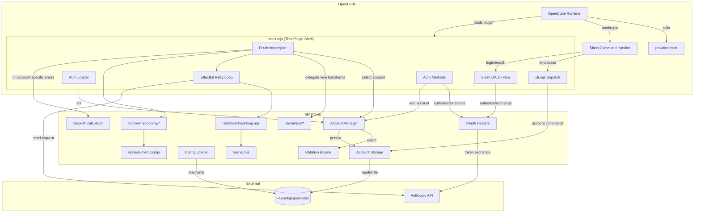
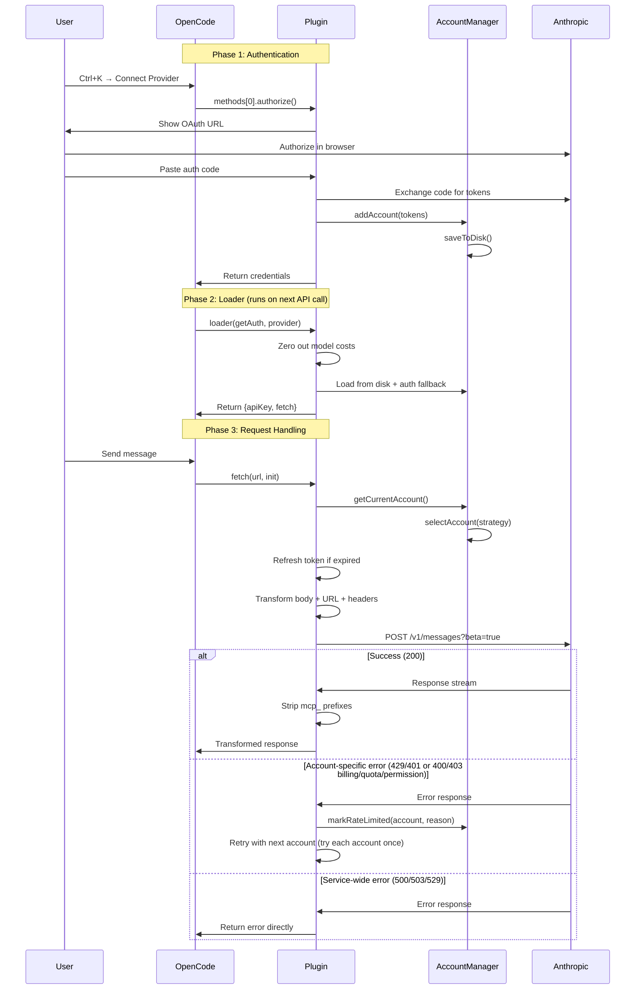
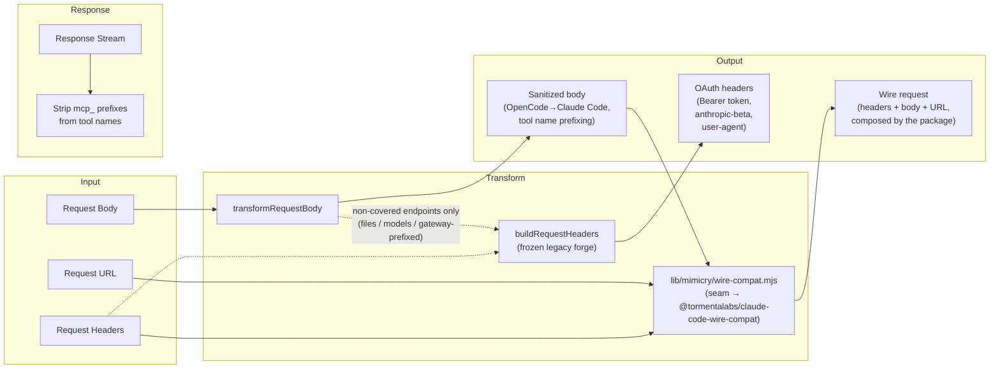
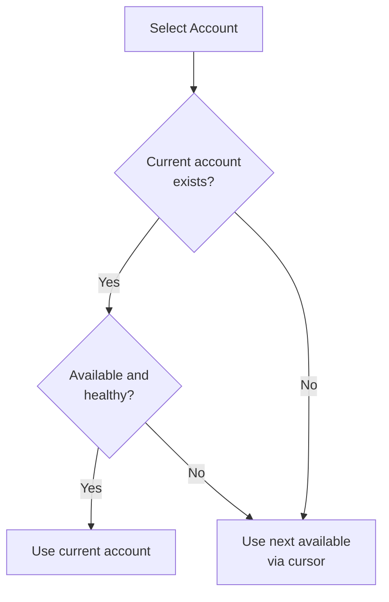
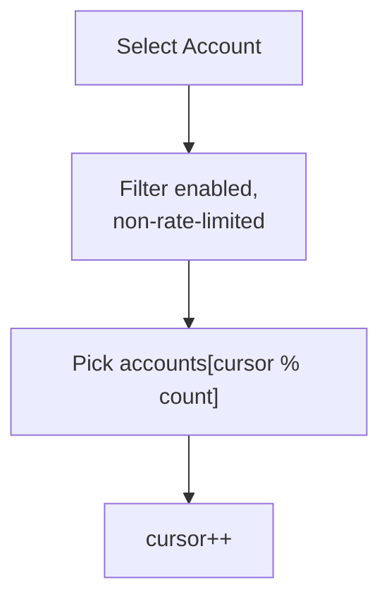
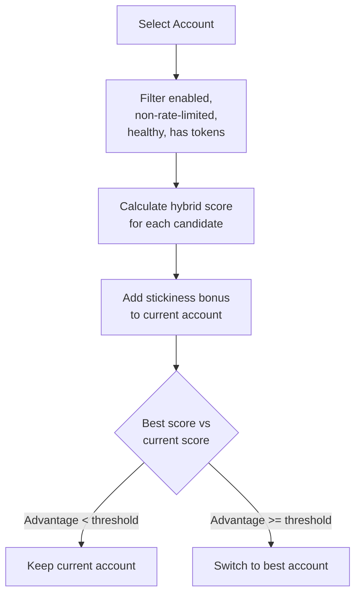
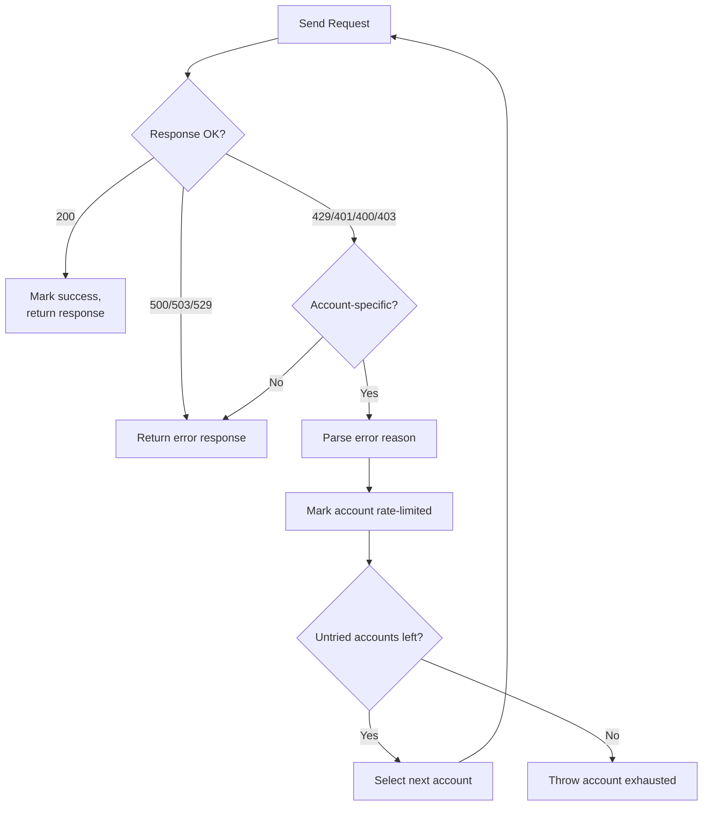

# Contributing

This document covers the architecture, implementation details, and development workflow for the multi-account fork of `opencode-anthropic-auth`.

## Development Setup

```bash
git clone https://github.com/actualyze-ai/opencode-anthropic-auth.git
cd opencode-anthropic-auth
npm install
npm run install:link   # Symlink plugin + CLI for live development
npm test               # Run all tests (~2s)
```

### Running Tests

```bash
npm test               # Single run
npm run test:watch     # Watch mode
```

Tests use [vitest](https://vitest.dev/). All modules are tested in isolation with mocked dependencies.

### Coverage

Run `npm run coverage` to generate V8 text, JSON summary, and HTML reports. Coverage thresholds are scoped by area:

- `lib/**`: at least 85% statements and 75% branches
- `index.mjs`: at least 56% statements and 52% branches
- `cli.mjs`: at least 69% statements and 60% branches

The `lib/**` thresholds are the permanent minimum. The `index.mjs` and `cli.mjs` baselines ratchet upward in Wave 3 as
their test coverage improves. See [the coverage baseline](docs/plans/qa/coverage-baseline.md) for current measurements.

### Linting and Formatting

```bash
npm run lint           # Check for lint errors
npm run lint:fix       # Fix auto-fixable lint errors
npm run format         # Format all files with Prettier
npm run format:check   # Check formatting without writing
```

Git hooks enforce quality automatically:

- **Pre-commit:** `lint-staged` runs Prettier and ESLint on staged `.mjs` files, Prettier on `.json`/`.md` files
- **Pre-push:** full test suite + Prettier format check

## Project Structure

```
opencode-anthropic-auth/
  index.mjs              Thin plugin shell (OAuth, fetch interceptor, effectful retry loop, slash commands)
  index.test.mjs         Plugin integration tests (lifecycle, fetch, transforms, slash commands)
  cli.mjs                Standalone CLI (17 subcommands, auth flows, live usage quotas)
  cli.test.mjs           CLI command tests (auth + account management + IO capture)
  package.json           Dependencies: wire compatibility + xxhash (prod), esbuild + vitest + eslint + prettier (dev)
  eslint.config.mjs      ESLint flat config
  .prettierrc            Prettier config
  .prettierignore        Prettier ignore patterns
  .husky/                Git hooks (pre-commit: lint-staged, pre-push: test + format check)
  lib/
    mimicry/             Wire mimicry (models, cache, response stream, system prompt, request helpers/body, headers)
    token-economy/       Token transforms and microcompaction decisions
    session-metrics.mjs  Shared token-economy session metrics singleton
    retry/
      overload-loop.mjs  Pure retry/overload decisions
    tuning.mjs           Retry and token-refresh tuning constants
    oauth.mjs            Shared OAuth helpers (authorize, exchange, revoke) — used by both plugin and CLI
    accounts.mjs         AccountManager class (pool management, selection, persistence)
    accounts.test.mjs    AccountManager tests
    rotation.mjs         HealthScoreTracker, TokenBucketTracker, selectAccount()
    rotation.test.mjs    Selection algorithm tests
    backoff.mjs          Rate limit parsing, backoff calculation
    backoff.test.mjs     Backoff calculation tests
    config.mjs           Config loader/saver, validation, env overrides
    config.test.mjs      Config loading/validation tests
    storage.mjs          Account persistence (atomic writes, deduplication)
    storage.test.mjs     Storage persistence tests
  scripts/
    build.mjs            esbuild bundler (produces dist/)
    install.mjs          Unified installer (link/copy/uninstall)
  dist/                  Build output (gitignored)
    opencode-anthropic-auth-plugin.js   Bundled plugin (self-contained)
    opencode-anthropic-auth-cli.mjs     Bundled CLI (self-contained)
```

## Architecture Overview

`index.mjs` is the thin, effectful interceptor/OAuth/retry shell. It delegates
wire behavior to `lib/mimicry/*` (`models`, `cache`, `response-stream`,
`system-prompt`, `request-helpers`, `request-body`, and `headers`), token economy
to `lib/token-economy/*` (`transforms` and `microcompact`) plus
`lib/session-metrics.mjs`, and pure retry decisions to
`lib/retry/overload-loop.mjs`, with tuning constants in `lib/tuning.mjs`.

Keep top-level `index.mjs` exports function-valued. Test-only internals belong on
`AnthropicAuthPlugin.__testing__` or `AnthropicAuthPlugin.__cacheInternals`.
Modules under `lib/` never import `index.mjs`; this dependency direction prevents
cycles.


```mermaid
graph TB
    subgraph OpenCode
        OC[OpenCode Runtime] -->|loads plugin| Plugin
        OC -->|calls| Fetch[provider.fetch]
        OC -->|/anthropic| SlashCmd[Slash Command Handler]
    end

    subgraph Plugin["index.mjs (Thin Plugin Shell)"]
        Auth[Auth Methods]
        Loader[Auth Loader]
        FetchInterceptor[Fetch Interceptor]
        RetryLoop[Effectful Retry Loop]
        SlashCmd -->|in-process| CLI[cli.mjs dispatch]
        SlashCmd -->|login/reauth| OAuthFlow[Slash OAuth Flow]
    end

    subgraph Core["lib/ (Core)"]
        OAuth[OAuth Helpers]
        AM[AccountManager]
        Rotation[Rotation Engine]
        Backoff[Backoff Calculator]
        Config[Config Loader]
        Storage[Account Storage]
        Mimicry[lib/mimicry/*]
        TokenEconomy[lib/token-economy/*]
        SessionMetrics[session-metrics.mjs]
        RetryDecisions[retry/overload-loop.mjs]
        Tuning[tuning.mjs]
    end

    subgraph External
        Anthropic[Anthropic API]
        Disk[(~/.config/opencode/)]
    end

    Auth -->|authorize/exchange| OAuth
    OAuthFlow -->|authorize/exchange| OAuth
    CLI -->|account commands| Storage
    Auth -->|add account| AM
    Loader -->|init| AM
    FetchInterceptor -->|select account| AM
    FetchInterceptor -->|delegate wire transforms| Mimicry
    FetchInterceptor --> RetryLoop
    FetchInterceptor --> TokenEconomy
    TokenEconomy --> SessionMetrics
    RetryLoop --> RetryDecisions
    RetryDecisions --> Tuning
    RetryLoop -->|send request| Anthropic
    FetchInterceptor -->|on account-specific errors| Backoff
    AM -->|select| Rotation
    AM -->|persist| Storage
    Storage -->|read/write| Disk
    Config -->|read/write| Disk
    OAuth -->|token exchange| Anthropic
```

## Plugin Lifecycle

The plugin integrates with OpenCode through five hooks:


```mermaid
sequenceDiagram
    participant User
    participant OpenCode
    participant Plugin
    participant AccountManager
    participant Anthropic

    Note over OpenCode,Plugin: Phase 1: Authentication
    User->>OpenCode: Ctrl+K → Connect Provider
    OpenCode->>Plugin: methods[0].authorize()
    Plugin->>User: Show OAuth URL
    User->>Anthropic: Authorize in browser
    User->>Plugin: Paste auth code
    Plugin->>Anthropic: Exchange code for tokens
    Plugin->>AccountManager: addAccount(tokens)
    AccountManager->>AccountManager: saveToDisk()
    Plugin->>OpenCode: Return credentials

    Note over OpenCode,Plugin: Phase 2: Loader (runs on next API call)
    OpenCode->>Plugin: loader(getAuth, provider)
    Plugin->>Plugin: Zero out model costs
    Plugin->>AccountManager: Load from disk + auth fallback
    Plugin->>OpenCode: Return {apiKey, fetch}

    Note over OpenCode,Plugin: Phase 3: Request Handling
    User->>OpenCode: Send message
    OpenCode->>Plugin: fetch(url, init)
    Plugin->>AccountManager: getCurrentAccount()
    AccountManager->>AccountManager: selectAccount(strategy)
    Plugin->>Plugin: Refresh token if expired
    Plugin->>Plugin: Transform body + URL + headers
    Plugin->>Anthropic: POST /v1/messages?beta=true
    alt Success (200)
        Anthropic->>Plugin: Response stream
        Plugin->>Plugin: Strip mcp_ prefixes
        Plugin->>OpenCode: Transformed response
    else Account-specific error (429/401 or 400/403 billing/quota/permission)
        Anthropic->>Plugin: Error response
        Plugin->>AccountManager: markRateLimited(account, reason)
        Plugin->>Plugin: Retry with next account (try each account once)
    else Service-wide error (500/503/529)
        Anthropic->>Plugin: Error response
        Plugin->>OpenCode: Return error directly
    end
```

## Request Transformation Pipeline

Every API request goes through a multi-stage transformation:


```mermaid
flowchart LR
    subgraph Input
        Body[Request Body]
        URL[Request URL]
        Headers[Request Headers]
    end

    subgraph Transform
        TB[transformRequestBody]
        WC["lib/mimicry/wire-compat.mjs<br/>(seam → @tormentalabs/claude-code-wire-compat)"]
        TH["buildRequestHeaders<br/>(frozen legacy forge)"]
    end

    subgraph Output
        OB["Sanitized body<br/>(OpenCode→Claude Code,<br/>tool name prefixing)"]
        OW["Wire request<br/>(headers + body + URL,<br/>composed by the package)"]
        OH["OAuth headers<br/>(Bearer token,<br/>anthropic-beta,<br/>user-agent)"]
    end

    Body --> TB --> OB
    OB --> WC --> OW
    URL --> WC
    Headers --> WC
    TB -. "non-covered endpoints only<br/>(files / models / gateway-prefixed)" .-> TH
    Headers -.-> TH --> OH

    subgraph Response
        RS[Response Stream] --> Strip["Strip mcp_ prefixes<br/>from tool names"]
    end
```

`lib/mimicry/wire-compat.mjs` is the **single seam** onto
`@tormentalabs/claude-code-wire-compat` (pinned by
`test/conformance/package-dependency-policy.test.mjs`), and the adapter path through it is
THE wire path for `/v1/messages` and `/v1/messages/count_tokens` with signature emulation on.
`buildRequestHeaders` survives only as a frozen compatibility exception for endpoints the
package has no surface for — files, models, gateway-prefixed routes — see the boundary banner
at the top of `lib/mimicry/headers.mjs`. With emulation off neither runs: see
`lib/passthrough-headers.mjs`.

### Body Transformations

| Step                       | What                                                                                                           | Why                                          |
| -------------------------- | -------------------------------------------------------------------------------------------------------------- | -------------------------------------------- |
| System prompt sanitization | Replace "OpenCode" with "Claude Code", "opencode" with "Claude" (preserves paths like `/path/to/opencode-foo`) | Anthropic's API blocks the string "OpenCode" |
| Tool definition prefixing  | Add `mcp_` prefix to `tools[].name`                                                                            | Required by Anthropic's OAuth API            |
| Tool use prefixing         | Add `mcp_` prefix to `tool_use` blocks in `messages[].content`                                                 | Matches the tool definition prefixes         |

### URL Transformations

| Step      | What                                  | Why                         |
| --------- | ------------------------------------- | --------------------------- |
| Beta flag | Append `?beta=true` to `/v1/messages` | Enables OAuth beta features |

### Header Transformations

With signature emulation ON, the headers are composed by the shared wire package (see
`lib/mimicry/adapter-input.mjs` and `docs/mimese-http-header-system-prompt.md`). The table below is the AUTH ENVELOPE —
the part the plugin owns on every path, emulation on or off:

| Step                      | What                                   | Why                                                               |
| ------------------------- | -------------------------------------- | ----------------------------------------------------------------- |
| Authorization             | `Bearer <access_token>`                | OAuth authentication                                              |
| Beta header               | append `oauth-2025-04-20` when missing | Contract of the OAuth token — the API rejects a bearer without it |
| Remove x-api-key          | Delete if present                      | A competing credential must not travel with our bearer            |
| Remove x-session-affinity | Delete if present                      | opencode SDK routing hint; leaks session identity upstream        |

With emulation OFF that envelope is ALL the plugin does: no forged user-agent, no substituted beta list, no body
transform. It is built by `lib/passthrough-headers.mjs`, deliberately outside `lib/mimicry/` — see the module comment
there for the boundary rule, and `README.md#signature-emulation` for the user-facing description.

### Response Transformations

| Step           | What                                         | Why                          |
| -------------- | -------------------------------------------- | ---------------------------- |
| Strip prefixes | Remove `mcp_` from `"name"` fields in stream | Undo the tool name prefixing |

## Account Selection Engine

### Strategy: Sticky (Default)


```mermaid
flowchart TD
    Start[Select Account] --> HasCurrent{Current account<br/>exists?}
    HasCurrent -->|Yes| IsAvailable{Available and<br/>healthy?}
    IsAvailable -->|Yes| UseCurrent[Use current account]
    IsAvailable -->|No| NextAvailable[Use next available<br/>via cursor]
    HasCurrent -->|No| NextAvailable
```

Stays on one account until it fails or is rate-limited. Best for single-account use.

### Strategy: Round-Robin


```mermaid
flowchart TD
    Start[Select Account] --> Filter[Filter enabled,<br/>non-rate-limited]
    Filter --> Pick["Pick accounts[cursor % count]"]
    Pick --> Advance[cursor++]
```

Rotates through accounts on every request. Spreads load evenly.

### Strategy: Hybrid


```mermaid
flowchart TD
    Start[Select Account] --> Filter[Filter enabled,<br/>non-rate-limited,<br/>healthy, has tokens]
    Filter --> Score[Calculate hybrid score<br/>for each candidate]
    Score --> Stickiness[Add stickiness bonus<br/>to current account]
    Stickiness --> Compare{Best score vs<br/>current score}
    Compare -->|"Advantage < threshold"| KeepCurrent[Keep current account]
    Compare -->|"Advantage >= threshold"| SwitchBest[Switch to best account]
```

**Hybrid score formula:**

```
score = (healthScore × 2) + ((tokens / maxTokens) × 500) + min(secondsSinceUsed, 3600) × 0.1
```

- **Health component** (0-200): Rewards reliable accounts
- **Token component** (0-500): Prefers accounts with available rate limit budget (`tokens / maxTokens` ratio scaled to 0-500)
- **Freshness component** (0-360): Slight preference for less recently used accounts
- **Stickiness bonus** (+150): Added to current account to prevent unnecessary switching
- **Switch threshold** (100): Must beat current by this much to trigger a switch

### Health Score System

Each account has a health score (0-100) that tracks reliability:

| Event              | Score Change |
| ------------------ | ------------ |
| Successful request | +1           |
| Rate limited       | -10          |
| General failure    | -20          |
| Passive recovery   | +2 per hour  |

Accounts below `min_usable` (default: 50) are skipped by the hybrid strategy.

### Token Bucket Rate Limiting

Client-side rate limiting prevents sending requests to accounts that are likely to be rate-limited:

| Parameter                      | Default | Description                      |
| ------------------------------ | ------- | -------------------------------- |
| `max_tokens`                   | 50      | Maximum tokens per account       |
| `regeneration_rate_per_minute` | 6       | Tokens regenerated per minute    |
| `initial_tokens`               | 50      | Starting tokens for new accounts |

Each request consumes 1 token. When an account runs out, it's skipped until tokens regenerate.

## Rate Limit Handling

### Error Classification

| HTTP Status / Body Classifier                      | Parsed Reason         | Default Backoff              |
| -------------------------------------------------- | --------------------- | ---------------------------- |
| 429                                                | `RATE_LIMIT_EXCEEDED` | 30s                          |
| 401                                                | `AUTH_FAILED`         | 5s                           |
| 400/403 with quota/billing/auth/permission signals | `QUOTA_EXHAUSTED`     | 1m, 5m, 30m, 2h (escalating) |
| 400/403 with rate-limit signals                    | `RATE_LIMIT_EXCEEDED` | 30s                          |
| 500/503/529                                        | service-wide          | no account switching         |

The `Retry-After` header always takes precedence over calculated backoffs.

### Retry Flow


```mermaid
flowchart TD
    Request[Send Request] --> Check{Response OK?}
    Check -->|200| Success[Mark success,<br/>return response]
    Check -->|500/503/529| ReturnError[Return error response]
    Check -->|429/401/400/403| Classify{Account-specific?}
    Classify -->|No| ReturnError
    Classify -->|Yes| Parse[Parse error reason]
    Parse --> Mark[Mark account rate-limited]
    Mark --> Attempts{Untried accounts left?}
    Attempts -->|Yes| NextAccount[Select next account]
    Attempts -->|No| Throw[Throw account exhausted]
    NextAccount --> Request
```

## Account Storage

### File Format

Accounts are stored at `~/.config/opencode/anthropic-accounts.json`:

```json
{
  "version": 1,
  "accounts": [
    {
      "email": "alice@example.com",
      "refreshToken": "rt_...",
      "addedAt": 1706000000000,
      "lastUsed": 1706000100000,
      "enabled": true,
      "rateLimitResetTimes": {},
      "consecutiveFailures": 0,
      "lastFailureTime": null
    }
  ],
  "activeIndex": 0
}
```

### Safety Measures

- **Atomic writes:** Write to temp file, then rename (prevents corruption on crash)
- **File permissions:** `0600` (owner read/write only)
- **Gitignore:** Auto-generated `.gitignore` in the config directory
- **Deduplication:** Accounts with the same refresh token are merged (keeps most recently used)
- **Debounced saves:** The plugin debounces disk writes to 1 second to avoid excessive I/O
- **Max accounts:** Hard limit of 10 accounts

## OpenCode Plugin API

### How Plugins Work

OpenCode plugins export an async function that receives a `{ client }` object and returns hooks:

```javascript
export async function AnthropicAuthPlugin({ client }) {
  return {
    // Hook: Register slash commands
    config: async (input) => {
      input.command ??= {};
      input.command["anthropic"] = {
        template: "/anthropic",
        description: "Manage Anthropic multi-account auth",
      };
    },

    // Hook: Handle slash commands (before default execution)
    "command.execute.before": async (input) => {
      if (input.command !== "anthropic") return;
      // Handle /anthropic subcommands...
      throw new Error("__HANDLED__"); // Prevents default handler
    },

    // Hook: Transform system prompts
    "experimental.chat.system.transform": (input, output) => { ... },

    // Hook: Authentication
    auth: {
      provider: "anthropic",           // Which provider this plugin handles
      loader(getAuth, provider) { ... }, // Called after auth is stored
      methods: [                        // Auth methods shown in Connect dialog
        { label: "...", type: "oauth", authorize: async () => { ... } },
        { label: "...", type: "api" },
      ],
    },
  };
}
```

### Key Integration Points

| Hook                                 | When It Runs                                | What It Does                                       |
| ------------------------------------ | ------------------------------------------- | -------------------------------------------------- |
| `config`                             | Plugin initialization                       | Registers `/anthropic` slash command               |
| `command.execute.before`             | User runs `/anthropic ...`                  | Routes to slash command handler (in-process CLI)   |
| `auth.methods[].authorize()`         | User clicks "Connect Provider"              | Starts OAuth flow, returns URL + callback          |
| `auth.methods[].callback(code)`      | User pastes auth code                       | Exchanges code for tokens, adds account            |
| `auth.loader(getAuth, provider)`     | After auth is stored, on each state refresh | Initializes AccountManager, returns custom `fetch` |
| `experimental.chat.system.transform` | Before each API call                        | Prepends "Claude Code" prefix to system prompt     |

### Slash Command Architecture

The `/anthropic` slash command runs CLI commands **deterministically in-process** (no subprocess spawning or PATH resolution). The plugin calls `cliMain(argv, { io })` directly, capturing console output via `AsyncLocalStorage`-based IO routing.

OAuth flows (`login`, `reauth`) are two-step in slash mode:

1. `/anthropic login` or `/anthropic reauth <N>` &mdash; starts OAuth flow, stores PKCE verifier in-memory with 10-minute TTL
2. `/anthropic login complete <code#state>` or `/anthropic reauth complete <code#state>` &mdash; exchanges code for tokens

Destructive commands (`remove`, `logout`) auto-inject `--force` to avoid readline prompts. Interactive `manage` is blocked with guidance to use granular commands.

### The `loader` Return Value

The loader returns an object with `apiKey` and `fetch`:

```javascript
return {
  apiKey: "", // Empty string (OAuth doesn't use API keys)
  async fetch(input, init) {
    // This replaces the default fetch for all Anthropic API calls
    // Handles: account selection, token refresh, request transformation,
    //          retry loop, response transformation
  },
};
```

OpenCode calls this `fetch` function instead of the global `fetch` for all requests to the Anthropic provider.

## Known Limitations

### Custom Provider Namespace

We investigated using a custom provider ID (e.g., `anthropic-oauth`) to avoid the conflict entirely. This doesn't work because OpenCode's `mergeProvider()` silently drops providers not found in the models.dev database:

```javascript
function mergeProvider(providerID, provider) {
  const existing = providers[providerID];
  if (existing) {
    /* merge */ return;
  }
  const match = database[providerID];
  if (!match) return; // ← silently drops unknown providers
  /* ... */
}
```

A custom provider requires `opencode.json` config with at least one model definition to bootstrap into the database. This adds significant config management overhead for marginal benefit.

## Testing

### Test Structure

| File                | Tests                                                       | Coverage                     |
| ------------------- | ----------------------------------------------------------- | ---------------------------- |
| `backoff.test.mjs`  | Rate limit parsing, backoff calculation                     | `lib/backoff.mjs`            |
| `rotation.test.mjs` | Health scores, token buckets, selection algorithms          | `lib/rotation.mjs`           |
| `config.test.mjs`   | Config loading, validation, env overrides                   | `lib/config.mjs`             |
| `storage.test.mjs`  | Account persistence, deduplication, atomic writes           | `lib/storage.mjs`            |
| `accounts.test.mjs` | AccountManager lifecycle, pool management, empty bootstrap  | `lib/accounts.mjs`           |
| `index.test.mjs`    | Plugin lifecycle, fetch interceptor, transforms, slash cmds | `index.mjs`, `lib/oauth.mjs` |
| `cli.test.mjs`      | CLI auth + account commands, IO capture, live usage quotas  | `cli.mjs`                    |

### Writing Tests

Tests mock filesystem and network calls. Use the existing patterns:

```javascript
import { describe, it, expect, vi, beforeEach } from "vitest";

// Mock dependencies before importing the module under test
vi.mock("./lib/storage.mjs", () => ({
  loadAccounts: vi.fn(),
  saveAccounts: vi.fn(),
  getStoragePath: vi.fn(() => "/mock/path"),
}));

// Import after mocking
import { cmdList } from "./cli.mjs";
```

### Running Specific Tests

```bash
npx vitest run backoff          # Run backoff tests only
npx vitest run --reporter=verbose  # Verbose output
```

## Dependencies

| Package                                 | Type       | Purpose                                                   |
| --------------------------------------- | ---------- | --------------------------------------------------------- |
| `@tormentalabs/claude-code-wire-compat` | Production | Claude Code wire compatibility                            |
| `xxhash-wasm`                           | Production | Fast request hashing                                      |
| `@opencode-ai/plugin`                   | Dev        | Plugin API type definitions (used via JSDoc)              |
| `esbuild`                               | Dev        | Bundles plugin + CLI into single files                    |
| `vitest`                                | Dev        | Test runner                                               |
| `eslint`                                | Dev        | Linter (flat config)                                      |
| `@eslint/js`                            | Dev        | ESLint recommended rules                                  |
| `prettier`                              | Dev        | Code formatter                                            |
| `husky`                                 | Dev        | Git hooks (pre-commit: lint-staged, pre-push: test + fmt) |
| `lint-staged`                           | Dev        | Runs prettier + eslint on staged files                    |

PKCE code generation for the OAuth flow is implemented locally in `lib/oauth.mjs`. The plugin's two production dependencies are bundled into the dist output by esbuild, so the bundled files have zero external dependencies beyond Node.js built-ins.

### Wire-package bump gate

`@tormentalabs/claude-code-wire-compat` is not an ordinary dependency: it composes the bytes the
plugin puts on the wire. A version bump is a **wire change until proven otherwise**. Adopting a new
release goes through this gate, in order, and each step is a stop condition:

1. **Bump through the registry.** `npm update @tormentalabs/claude-code-wire-compat`. The lockfile
   must resolve the new version from the npm registry with a `resolved` URL and an `integrity`
   hash — a `file:` or `link:` resolution is a local artifact, not a release, and
   `test/conformance/package-dependency-policy.test.mjs` fails on it. **The lockfile diff is the
   first review artifact.**
2. **Green before you touch anything.** Run the full suite on the bumped lockfile _before_ making a
   single plugin edit. A failure here is the package's behaviour change speaking, uncontaminated by
   your own. Editing first destroys that signal.
3. **`npx vitest run wire-baseline` must pass 16/16 with zero re-seal.** These fixtures are the
   plugin's byte-level wire contract. Any fixture diff means the package moved the wire, and it
   must be reviewed **vector by vector** and justified per vector in the commit message before a
   re-seal is even considered. The re-sealing procedure, and the standing rule that a re-seal is
   never routine, are documented in the header of
   `test/conformance/wire-baseline.test.mjs` — read it there rather than reconstructing it.

Known-risk tests to expect on a bump, and what each one actually means:

| Test                                  | Fires when                                                                     |
| ------------------------------------- | ------------------------------------------------------------------------------ |
| `canonical-prefix-once.test.mjs`      | The canonical system prefix bytes moved — a byte pin, not a formatting check   |
| `wire-compat-input-coverage.test.mjs` | The package declared a new request-input field (it parses the shipped `.d.ts`) |
| `package-dependency-policy.test.mjs`  | The resolution is not a registry release, or `resolved`/`version` disagree     |

`docs/mimicry/wire-compat-divergences.md` carries the longer per-failure triage sequence and the
`DEFAULT_PROFILE`-moved checklist.
