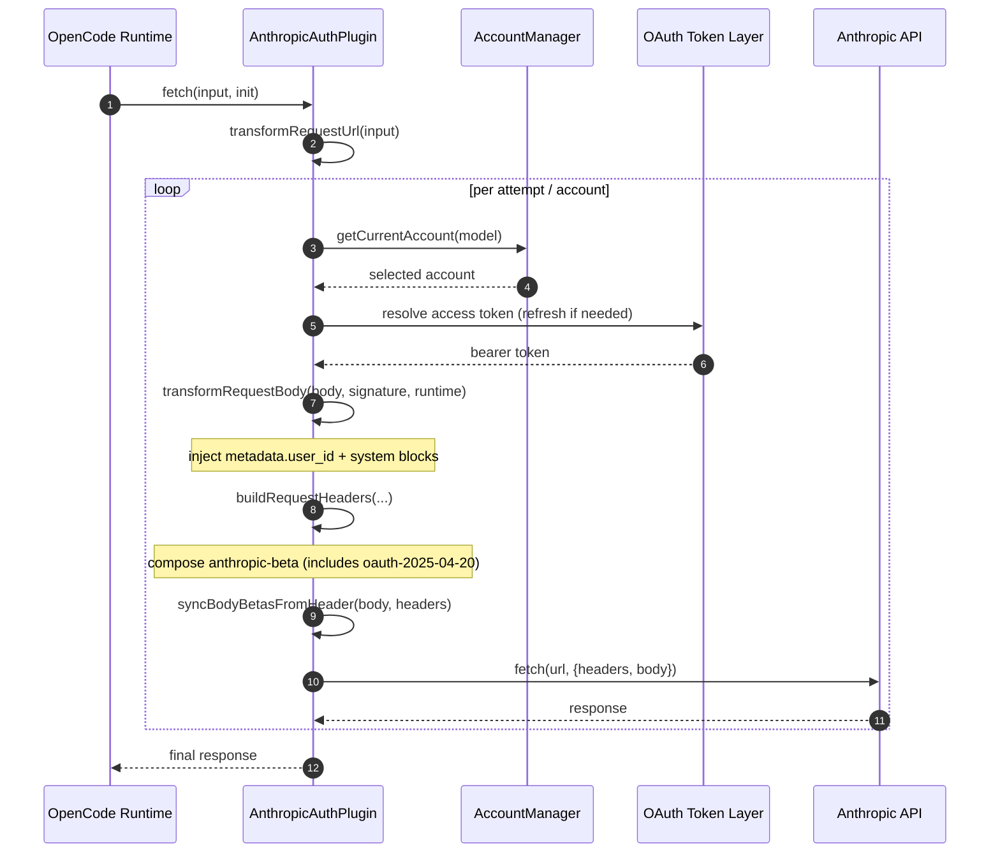

# Detailed Mimicry of HTTP Headers and System Prompt

This document explains, at implementation level, how the plugin mimics Claude Code signature behavior for Anthropic requests, with focus on:

- HTTP header composition
- `system` composition in the request body
- related auxiliary fields (`metadata`, `betas`, URL shaping, and toggles)

Primary code references:

- `index.mjs`
- `lib/config.mjs`

## 1) Control switch (on/off)

Mimicry is controlled by `signature_emulation`:

```jsonc
{
  "signature_emulation": {
    "enabled": true,
    "fetch_claude_code_version_on_startup": true,
    "prompt_compaction": "minimal",
  },
}
```

Environment overrides (in `lib/config.mjs`):

- `OPENCODE_ANTHROPIC_EMULATE_CLAUDE_CODE_SIGNATURE`
  - `1/true` => enabled
  - `0/false` => disabled
- `OPENCODE_ANTHROPIC_FETCH_CLAUDE_CODE_VERSION`
  - `1/true` => fetch latest `@anthropic-ai/claude-code` version on startup
  - `0/false` => keep internal fallback version
- `OPENCODE_ANTHROPIC_PROMPT_COMPACTION`
  - `minimal` => compact long system instruction blocks (default)
  - `off` => disable compaction

When `signature_emulation.enabled=false`, the plugin falls back to legacy system-prompt transform behavior (Claude Code prefix via `experimental.chat.system.transform`) and does not apply the full header/system mimicry block documented below.

## 2) Claude CLI version used in signature behavior

In `AnthropicAuthPlugin`:

- initial fallback version: `2.1.2`
- if `fetch_claude_code_version_on_startup=true`, it performs GET on:
  - `https://registry.npmjs.org/@anthropic-ai/claude-code/latest`
- short timeout (AbortController); failures are silent and fallback remains active

This version is used by:

- `user-agent`
- `x-stainless-package-version`
- `x-anthropic-billing-header` generation in `system`

## 3) Request flow where mimicry is applied

Inside `auth.loader().fetch(...)`:

1. transform URL (`transformRequestUrl`)
2. select account and resolve token (including refresh when needed)
3. transform body (`transformRequestBody`) with runtime context
4. build headers (`buildRequestHeaders`)
5. execute `fetch`

Important: body transform happens per-attempt/per-account (not only once), so `metadata.user_id` includes the actual `accountId` in use for that attempt.

### 3.1 Protocol sequence diagram (Mermaid)


```mermaid
sequenceDiagram
    autonumber
    participant Client as OpenCode Runtime
    participant Plugin as AnthropicAuthPlugin
    participant Account as AccountManager
    participant OAuth as OAuth Token Layer
    participant API as Anthropic API

    Client->>Plugin: fetch(input, init)
    Plugin->>Plugin: transformRequestUrl(input)

    loop per attempt / account
        Plugin->>Account: getCurrentAccount(model)
        Account-->>Plugin: selected account

        Plugin->>OAuth: resolve access token (refresh if needed)
        OAuth-->>Plugin: bearer token

        Plugin->>Plugin: transformRequestBody(body, signature, runtime)
        Note over Plugin: inject metadata.user_id + system blocks

        Plugin->>Plugin: buildRequestHeaders(...)
        Note over Plugin: compose anthropic-beta (includes oauth-2025-04-20)

        Plugin->>Plugin: syncBodyBetasFromHeader(body, headers)
        Plugin->>API: fetch(url, {headers, body})
        API-->>Plugin: response
    end

    Plugin-->>Client: final response
```

## 4) HTTP header mimicry

### 4.1 Headers always applied

`buildRequestHeaders(...)` always ensures:

- `authorization: Bearer <token>`
  - default token: account OAuth access token
  - optional override: `ANTHROPIC_AUTH_TOKEN` (if set, takes precedence)
- `anthropic-beta: <final beta list>`
- `user-agent: claude-cli/<version> (external, <entrypoint>[, agent-sdk/<v>][, client-app/<app>])`
  - `entrypoint`: `CLAUDE_CODE_ENTRYPOINT` or `cli`
  - optional suffixes:
    - `CLAUDE_AGENT_SDK_VERSION`
    - `CLAUDE_AGENT_SDK_CLIENT_APP`
- always removes `x-api-key`

### 4.2 Extra headers when mimicry is enabled

With `signature.enabled=true`, it adds:

- `anthropic-version: 2023-06-01`
- `x-app: cli`
- `x-stainless-arch: <x64|arm64|...>`
- `x-stainless-lang: js`
- `x-stainless-os: <macOS|Windows|Linux|...>`
- `x-stainless-package-version: <sdkVersion>` (Anthropic SDK version, e.g. `0.208.0`)
- `x-stainless-runtime: node`
- `x-stainless-runtime-version: <process.version>`
- `x-stainless-retry-count`
  - preserves incoming value when present and not explicitly falsy
  - otherwise sets `0`
- `x-stainless-helper`
  - extracted dynamically from `tools`/`messages` in body
  - scans keys: `x_stainless_helper`, `x-stainless-helper`, `stainless_helper`, `stainlessHelper`, `_stainless_helper`
  - aggregates unique values as comma-separated list

It also injects optional env-driven headers:

- `ANTHROPIC_CUSTOM_HEADERS` (multiline `Header-Name: value`)
  - each valid line is converted into a header
- `CLAUDE_CODE_CONTAINER_ID` => `x-claude-remote-container-id`
- `CLAUDE_CODE_REMOTE_SESSION_ID` => `x-claude-remote-session-id`
- `CLAUDE_AGENT_SDK_CLIENT_APP` => `x-client-app`
- `CLAUDE_CODE_ADDITIONAL_PROTECTION=1/true/yes` => `x-anthropic-additional-protection: true`
- `x-client-request-id: <uuid>` (v2.1.84+, unique per request for debugging stream timeouts)

### 4.3 OAuth token-layer user-agent mimicry

OAuth token calls use axios-fingerprint headers matching the real CLI's bundled HTTP client:

- `POST /v1/oauth/token` (exchange and refresh)

Headers sent:

- `User-Agent: axios/1.13.6`
- `Accept: application/json, text/plain, */*`
- `Content-Type: application/json`

Without these headers, Anthropic's OAuth token endpoints return HTTP 429.

### 4.4 WebFetch user-agent (intentional divergence)

**Design decision:** The plugin intentionally does NOT use Claude Code's `Claude-User` UA for web scraping.

Claude Code v2.1.84 sends: `Claude-User (claude-code/{version}; +https://support.anthropic.com/)`

The plugin instead sends a standard Chrome browser User-Agent. Rationale:

1. `Claude-User` self-identifies as an AI bot, causing many sites to block or degrade responses
2. A Chrome UA gets past virtually all bot-detection (robots.txt, Cloudflare AI rules, WAFs)
3. The WebFetch UA is client-side only — Anthropic cannot observe it on their API endpoints
4. This produces materially better web scraping results for end users

## 5) Beta header catalog (Claude Code reference vs current plugin)

### 5.1 Beta composition rule in the plugin

Function: `buildAnthropicBetaHeader(incomingBeta, signatureEnabled, model, provider, customBetas, strategy, requestPath, hasFileReferences)`

- starts with `oauth-2025-04-20`
- preserves incoming betas (`incomingBeta`) and deduplicates on merge
- accepts `strategy` (`"sticky"`, `"round-robin"`, `"hybrid"`) to conditionally exclude stateful betas
- applies endpoint/content-aware betas using `requestPath` and `hasFileReferences`

When `signatureEnabled=false`:

- adds `interleaved-thinking-2025-05-14` (in addition to OAuth beta)
- adds `token-counting-2024-11-01` for `/v1/messages/count_tokens`

When `signatureEnabled=true`, current implementation may add dynamically:

- `claude-code-20250219` (not added for Haiku models)
- `files-api-2025-04-14` (only for `/v1/files` or when body references `file_id`)
- `effort-2025-11-24` (Opus 4.6 models)
- `interleaved-thinking-2025-05-14` (if model supports it and not disabled by `DISABLE_INTERLEAVED_THINKING`)
- `context-1m-2025-08-07` (if model indicates 1M context)
- `context-management-2025-06-27` (non-interactive mode + flags)
- `structured-outputs-2025-12-15` (model supports it + `TENGU_TOOL_PEAR`)
- `tool-examples-2025-10-29` (non-interactive mode + `TENGU_SCARF_COFFEE`)
- `web-search-2025-03-05` (provider `vertex`/`foundry` + supported model)
- `prompt-caching-scope-2026-01-05` (non-interactive mode; **skipped in round-robin** — cache is per-workspace)
- `token-counting-2024-11-01` (for `/v1/messages/count_tokens`)
- additional betas from `ANTHROPIC_BETAS` (all models, including Haiku)
- `custom_betas` from config

Experimental beta safety switch:

- if `CLAUDE_CODE_DISABLE_EXPERIMENTAL_BETAS=1/true/yes`, known experimental betas are stripped from the final header
- this mirrors Claude Code's gateway-safety behavior used to avoid validation regressions on some routes/providers

Strategy filter:

- if `strategy` is `"round-robin"`, the following betas are excluded to avoid per-account state conflicts:
  - `prompt-caching-scope-2026-01-05` (cache is per-workspace)
- the `OPENCODE_ANTHROPIC_INITIAL_ACCOUNT` env var overrides the strategy to `sticky` for the session, re-enabling strategy-sensitive auto betas

Provider filter:

- if detected provider is `bedrock`, remove betas listed in `BEDROCK_UNSUPPORTED_BETAS` (includes `code-execution-2025-08-25` and `files-api-2025-04-14`).

Provider detection is based on request URL hostname (`anthropic`, `bedrock`, `vertex`, `foundry`).

### 5.2 Claude Code reference beta list (consolidated)

Automatically enabled by Claude Code (functional reference):

- `claude-code-20250219`
- `interleaved-thinking-2025-05-14`
- `context-1m-2025-08-07`
- `context-management-2025-06-27`
- `structured-outputs-2025-12-15`
- `tool-examples-2025-10-29`
- `prompt-caching-scope-2026-01-05`
- `effort-2025-11-24`
- `fast-mode-2026-02-01`
- `oauth-2025-04-20`
- `token-counting-2024-11-01` (preflight `/v1/messages/count_tokens`)

Now auto-included by the plugin:

- `advanced-tool-use-2025-11-20` (upstream 2.1.79+ base profile)
- `fast-mode-2026-02-01` (upstream 2.1.79+ base profile)
- `files-api-2025-04-14` (only `/v1/files` and Messages requests that reference `file_id`)
- `effort-2025-11-24` (Opus 4.6)
- `token-counting-2024-11-01` (preflight `/v1/messages/count_tokens`)

Available via `/anthropic betas add` or `ANTHROPIC_BETAS`:

- `message-batches-2024-09-24`
- `compact-2026-01-12`
- `mcp-servers-2025-12-04`
- `code-execution-2025-08-25`

Platform-specific betas (not cross-provider defaults):

- `bedrock-2023-05-31`
- `vertex-2023-10-16`
- `oauth-2025-04-20`
- `ccr-byoc-2025-07-29`

### 5.3 Current plugin gaps vs reference

No dedicated automatic composition yet for:

- `redact-thinking-2026-02-12` (intentionally opt-in — OpenCode users benefit from seeing thinking blocks)
- `afk-mode-2026-01-31`
- `tool-search-tool-2025-10-19`
- `task-budgets-2026-03-13` (v2.1.84+ — conditional on taskBudget presence; proxy repasses body as-is)
- `advisor-tool-2026-03-01` (v2.1.84+ — feature-flagged, niche)

These can still be injected manually through `ANTHROPIC_BETAS` or `/anthropic betas add` when operationally required.

### 5.4 Important note on fine-grained tool streaming

In Claude Code, `fine-grained-tool-streaming` is primarily modeled through tool fields (`eager_input_streaming=true`) and feature/env flags, not as a mandatory beta header dependency.

This plugin no longer auto-includes `fine-grained-tool-streaming-2025-05-14` in the default beta header, matching the current reference behavior more closely.

## 6) System prompt mimicry

### 6.1 Block normalization

`normalizeSystemTextBlocks(system)` converts `system` into an array of objects:

- strings become `{ type: "text", text: "..." }`
- objects with string `text` are preserved
- preserves `cache_control` when present

### 6.2 Text sanitization

`sanitizeSystemText(text)` applies:

- `OpenCode` => `Claude Code`
- `opencode`/`OpenCode` variants => `Claude`
  - except when preceded by `/` (path-like occurrence preserved)

### 6.3 Injected blocks when mimicry is enabled

`buildSystemPromptBlocks(...)`:

1. sanitizes all blocks
2. removes pre-existing blocks that are already:
   - `x-anthropic-billing-header: ...`
   - known identity strings (`KNOWN_IDENTITY_STRINGS`)
3. builds final ordered list:
   - (optional) billing header block
   - canonical identity block with `cache_control: { type: "ephemeral" }`
   - original filtered/sanitized blocks

Canonical identity string:

- `You are Claude Code, Anthropic's official CLI for Claude.`

### 6.4 Billing header generation

`buildAnthropicBillingHeader(claudeCliVersion)`:

- can be disabled by `CLAUDE_CODE_ATTRIBUTION_HEADER=0/false/no`
- generates a random 5-hex-char `cch` value per request (`randomBytes(3).toString("hex").slice(0, 5)`)
- builds:

```text
x-anthropic-billing-header: cc_version=<claudeCliVersion>; cc_entrypoint=<entrypoint>; cch=<5-hex>;
```

Detail: `cc_entrypoint` uses `CLAUDE_CODE_ENTRYPOINT` or `cli` (matching upstream default). The `cch` is non-deterministic per request, matching upstream Claude Code behavior.

## 7) Body fields related to mimicry

When mimicry is enabled, `transformRequestBody(...)` adds/updates:

- `metadata.user_id` with format:
  - `user_<persistentUserId>_account_<accountId>_session_<sessionId>`

Where:

- `persistentUserId`:
  - optional override via `OPENCODE_ANTHROPIC_SIGNATURE_USER_ID`
  - otherwise loaded from persisted file at `getConfigDir()/anthropic-signature-user-id`
  - if absent, generates UUID and persists it
- `sessionId`: UUID generated once per plugin initialization
- `accountId`: `account.accountUuid` when present; fallback to `account.id`

The plugin does not inject a `betas` field into request body. Beta flags are sent via `anthropic-beta` header only.

### 7.2 `context_management` body field (v2.1.84+)

When extended thinking is active (`thinking.type` is `"adaptive"` or `"enabled"`), the plugin injects:

```json
{
  "context_management": {
    "edits": [{ "type": "clear_thinking_20251015", "keep": "all" }]
  }
}
```

This tells the API how to handle thinking blocks during context management operations. Only injected when the field is not already present in the request body.

### 7.3 `speed` body field (fast mode)

When `fast_mode` config is enabled and the model is Opus 4.6 or Sonnet 4.6:

```json
{
  "speed": "fast"
}
```

This enables server-side fast-mode processing. Can be disabled via `OPENCODE_ANTHROPIC_DISABLE_FAST_MODE=1`.

## 8) Related URL shaping

`transformRequestUrl(input)` appends `?beta=true` for `/v1/messages` and `/v1/messages/count_tokens` requests when the query parameter is not already present.

## 9) Compatibility and fallback behavior

- Mimicry is enabled by default (config default)
- If disabled, plugin keeps auth/rotation behavior and uses legacy system transform path
- JSON parse failures in body transform do not break requests (original body is preserved)
- IO failures while persisting `persistentUserId` do not break requests (runtime UUID remains usable)
- NPM version fetch failure does not break startup (fallback version is used)

## 10) Quick verification checklist

To audit whether mimicry is active at runtime:

1. confirm `signature_emulation.enabled=true` (config or env)
2. inspect request headers and verify `x-stainless-*`, `x-app`, `anthropic-version`
3. verify `anthropic-beta` includes expected flags for model/provider
4. inspect body and confirm:
   - `system[0..]` includes identity block (and billing block unless disabled)
   - `metadata.user_id` follows composed format
   - `betas` is aligned with header
