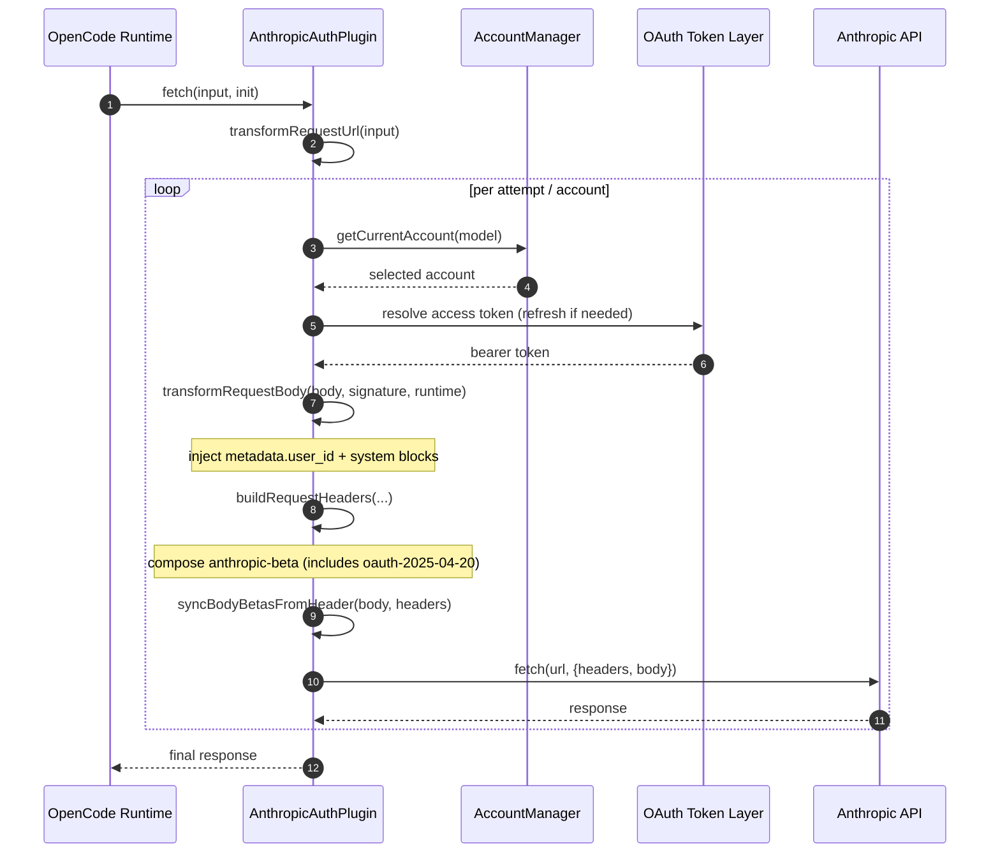

# Detailed Mimicry of HTTP Headers and System Prompt

This document explains, at implementation level, how the plugin mimics Claude Code signature behavior for Anthropic requests, with focus on:

- HTTP header composition
- `system` composition in the request body
- related auxiliary fields (`metadata`, `betas`, URL shaping, and toggles)

Primary code references:

- `index.mjs`
- `lib/config.mjs`

## 1) Control switch (on/off)

Mimicry is controlled by `signature_emulation`:

```jsonc
{
  "signature_emulation": {
    "enabled": true,
    "fetch_claude_code_version_on_startup": true,
    "prompt_compaction": "minimal",
  },
}
```

Environment overrides (in `lib/config.mjs`):

- `OPENCODE_ANTHROPIC_EMULATE_CLAUDE_CODE_SIGNATURE`
  - `1/true` => enabled
  - `0/false` => disabled
- `OPENCODE_ANTHROPIC_FETCH_CLAUDE_CODE_VERSION`
  - `1/true` => fetch latest `@anthropic-ai/claude-code` version on startup
  - `0/false` => keep internal fallback version
- `OPENCODE_ANTHROPIC_PROMPT_COMPACTION`
  - `minimal` => compact long system instruction blocks (default)
  - `off` => disable compaction

When `signature_emulation.enabled=false`, the plugin falls back to legacy system-prompt transform behavior (Claude Code prefix via `experimental.chat.system.transform`) and does not apply the full header/system mimicry block documented below.

## 2) Claude CLI version used in signature behavior

In `AnthropicAuthPlugin`:

- initial fallback version: `2.1.2`
- if `fetch_claude_code_version_on_startup=true`, it performs GET on:
  - `https://registry.npmjs.org/@anthropic-ai/claude-code/latest`
- short timeout (AbortController); failures are silent and fallback remains active

This version is used by:

- `user-agent`
- `x-stainless-package-version`
- `x-anthropic-billing-header` generation in `system`

## 3) Request flow where mimicry is applied

Inside `auth.loader().fetch(...)`:

1. transform URL (`transformRequestUrl`)
2. select account and resolve token (including refresh when needed)
3. transform body (`transformRequestBody`) with runtime context
4. build headers (`buildRequestHeaders`)
5. execute `fetch`

Important: body transform happens per-attempt/per-account (not only once), so `metadata.user_id` includes the actual `accountId` in use for that attempt.

### 3.1 Protocol sequence diagram (Mermaid)


```mermaid
sequenceDiagram
    autonumber
    participant Client as OpenCode Runtime
    participant Plugin as AnthropicAuthPlugin
    participant Account as AccountManager
    participant OAuth as OAuth Token Layer
    participant API as Anthropic API

    Client->>Plugin: fetch(input, init)
    Plugin->>Plugin: transformRequestUrl(input)

    loop per attempt / account
        Plugin->>Account: getCurrentAccount(model)
        Account-->>Plugin: selected account

        Plugin->>OAuth: resolve access token (refresh if needed)
        OAuth-->>Plugin: bearer token

        Plugin->>Plugin: transformRequestBody(body, signature, runtime)
        Note over Plugin: inject metadata.user_id + system blocks

        Plugin->>Plugin: buildRequestHeaders(...)
        Note over Plugin: compose anthropic-beta (includes oauth-2025-04-20)

        Plugin->>Plugin: syncBodyBetasFromHeader(body, headers)
        Plugin->>API: fetch(url, {headers, body})
        API-->>Plugin: response
    end

    Plugin-->>Client: final response
```

## 4) HTTP header mimicry

### 4.1 Headers always applied

`buildRequestHeaders(...)` always ensures:

- `authorization: Bearer <token>`
  - default token: account OAuth access token
  - optional override: `ANTHROPIC_AUTH_TOKEN` (if set, takes precedence)
- `anthropic-beta: <final beta list>`
- `user-agent: claude-cli/<version> (external, <entrypoint>[, agent-sdk/<v>][, client-app/<app>])`
  - `entrypoint`: `CLAUDE_CODE_ENTRYPOINT` or `cli`
  - optional suffixes:
    - `CLAUDE_AGENT_SDK_VERSION`
    - `CLAUDE_AGENT_SDK_CLIENT_APP`
- always removes `x-api-key`

### 4.2 Extra headers when mimicry is enabled

With `signature.enabled=true`, it adds:

- `anthropic-version: 2023-06-01`
- `x-app: cli` (or `cli-bg` when `CLAUDE_CODE_BACKGROUND=1`)
- `X-Claude-Code-Session-Id: <sessionId>` (same UUID as `metadata.user_id.session_id`)
- `x-stainless-arch: <x64|arm64|...>`
- `x-stainless-lang: js`
- `x-stainless-os: <macOS|Windows|Linux|...>`
- `x-stainless-package-version: <sdkVersion>` (Anthropic SDK version, e.g. `0.208.0`)
- `x-stainless-runtime: node`
- `x-stainless-runtime-version: <process.version>`
- `x-stainless-retry-count`
  - preserves incoming value when present and not explicitly falsy
  - otherwise sets `0`
- `x-stainless-helper`
  - extracted dynamically from `tools`/`messages` in body
  - scans keys: `x_stainless_helper`, `x-stainless-helper`, `stainless_helper`, `stainlessHelper`, `_stainless_helper`
  - aggregates unique values as comma-separated list

It also injects optional env-driven headers:

- `ANTHROPIC_CUSTOM_HEADERS` (multiline `Header-Name: value`)
  - each valid line is converted into a header
- `CLAUDE_CODE_CONTAINER_ID` => `x-claude-remote-container-id`
- `CLAUDE_CODE_REMOTE_SESSION_ID` => `x-claude-remote-session-id`
- `CLAUDE_AGENT_SDK_CLIENT_APP` => `x-client-app`
- `CLAUDE_CODE_ADDITIONAL_PROTECTION=1/true/yes` => `x-anthropic-additional-protection: true`
- `x-client-request-id: <uuid>` (v2.1.84+, unique per request for debugging stream timeouts)

### 4.3 OAuth token-layer user-agent mimicry

OAuth token calls use axios-fingerprint headers matching the real CLI's bundled HTTP client:

- `POST /v1/oauth/token` (exchange and refresh)

Headers sent:

- `User-Agent: axios/1.13.6`
- `Accept: application/json, text/plain, */*`
- `Content-Type: application/json`

Without these headers, Anthropic's OAuth token endpoints return HTTP 429.

### 4.4 WebFetch user-agent (intentional divergence)

**Design decision:** The plugin intentionally does NOT use Claude Code's `Claude-User` UA for web scraping.

Claude Code v2.1.84 sends: `Claude-User (claude-code/{version}; +https://support.anthropic.com/)`

The plugin instead sends a standard Chrome browser User-Agent. Rationale:

1. `Claude-User` self-identifies as an AI bot, causing many sites to block or degrade responses
2. A Chrome UA gets past virtually all bot-detection (robots.txt, Cloudflare AI rules, WAFs)
3. The WebFetch UA is client-side only — Anthropic cannot observe it on their API endpoints
4. This produces materially better web scraping results for end users

## 5) Beta header catalog (Claude Code reference vs current plugin)

### 5.1 Beta composition rule in the plugin

Function: `buildAnthropicBetaHeader(incomingBeta, signatureEnabled, model, provider, customBetas, strategy, requestPath, hasFileReferences)`

- starts with `oauth-2025-04-20`
- preserves incoming betas (`incomingBeta`) and deduplicates on merge
- accepts `strategy` (`"sticky"`, `"round-robin"`, `"hybrid"`) to conditionally exclude stateful betas
- applies endpoint/content-aware betas using `requestPath` and `hasFileReferences`

When `signatureEnabled=false`:

- adds `interleaved-thinking-2025-05-14` (in addition to OAuth beta)
- adds `token-counting-2024-11-01` for `/v1/messages/count_tokens`

When `signatureEnabled=true`, current implementation may add dynamically:

- `claude-code-20250219` (not added for Haiku models)
- `files-api-2025-04-14` (only for `/v1/files` or when body references `file_id`)
- `effort-2025-11-24` (Opus 4.6 models)
- `interleaved-thinking-2025-05-14` (if model supports it and not disabled by `DISABLE_INTERLEAVED_THINKING`)
- `context-1m-2025-08-07` (if model indicates 1M context)
- `context-management-2025-06-27` (non-interactive mode + flags)
- `structured-outputs-2025-12-15` (model supports it + `TENGU_TOOL_PEAR`)
- `web-search-2025-03-05` (provider `vertex`/`foundry` + supported model)
- `prompt-caching-scope-2026-01-05` (non-interactive mode; **skipped in round-robin** — cache is per-workspace)
- `token-counting-2024-11-01` (for `/v1/messages/count_tokens`)
- additional betas from `ANTHROPIC_BETAS` (all models, including Haiku)
- `custom_betas` from config

Experimental beta safety switch:

- if `CLAUDE_CODE_DISABLE_EXPERIMENTAL_BETAS=1/true/yes`, known experimental betas are stripped from the final header
- this mirrors Claude Code's gateway-safety behavior used to avoid validation regressions on some routes/providers

Strategy filter:

- if `strategy` is `"round-robin"`, the following betas are excluded to avoid per-account state conflicts:
  - `prompt-caching-scope-2026-01-05` (cache is per-workspace)
- the `OPENCODE_ANTHROPIC_INITIAL_ACCOUNT` env var overrides the strategy to `sticky` for the session, re-enabling strategy-sensitive auto betas

Provider filter:

- if detected provider is `bedrock`, remove betas listed in `BEDROCK_UNSUPPORTED_BETAS` (includes `code-execution-2025-08-25` and `files-api-2025-04-14`).

Provider detection is based on request URL hostname (`anthropic`, `bedrock`, `vertex`, `foundry`).

### 5.2 Claude Code reference beta list (consolidated)

Automatically enabled by Claude Code (functional reference):

- `claude-code-20250219`
- `interleaved-thinking-2025-05-14`
- `context-1m-2025-08-07`
- `context-management-2025-06-27`
- `structured-outputs-2025-12-15`
- `prompt-caching-scope-2026-01-05`
- `effort-2025-11-24`
- `fast-mode-2026-02-01`
- `oauth-2025-04-20`
- `token-counting-2024-11-01` (preflight `/v1/messages/count_tokens`)
- `task-budgets-2026-03-13` (conditional on task budget presence)

Now auto-included by the plugin:

- `advanced-tool-use-2025-11-20` (upstream 2.1.79+ base profile)
- `fast-mode-2026-02-01` (upstream 2.1.79+ base profile)
- `files-api-2025-04-14` (only `/v1/files` and Messages requests that reference `file_id`)
- `effort-2025-11-24` (Opus 4.6)
- `token-counting-2024-11-01` (preflight `/v1/messages/count_tokens`)

Available via `/anthropic betas add` or `ANTHROPIC_BETAS`:

- `message-batches-2024-09-24`
- `compact-2026-01-12`
- `mcp-servers-2025-12-04`
- `code-execution-2025-08-25`

Platform-specific betas (not cross-provider defaults):

- `bedrock-2023-05-31`
- `vertex-2023-10-16`
- `oauth-2025-04-20`
- `ccr-byoc-2025-07-29`

### 5.3 Current plugin gaps vs reference

Newly auto-included in v0.0.38:

- `token-efficient-tools-2026-03-28` (default on, `config.token_economy.token_efficient_tools`)
- `summarize-connector-text-2026-03-13` (default on, `config.token_economy.connector_text_summarization`)
- `redact-thinking-2026-02-12` (opt-in, `config.token_economy.redact_thinking`)
- `advanced-tool-use-2025-11-20` for 1P/foundry provider (was incorrectly using 3P header)

No dedicated automatic composition yet for:

- `afk-mode-2026-01-31` (transcript classifier — ant-only)
- `advisor-tool-2026-03-01` (v2.1.84+ — feature-flagged, niche)
- `cli-internal-2026-02-09` (ant-only)

`task-budgets-2026-03-13` is available as a BETA_SHORTCUTS shortcut (`task-budgets` / `budgets`) and propagates `output_config` body injection when active.

Remaining gaps can be injected manually through `ANTHROPIC_BETAS` or `/anthropic betas add` when operationally required.

**Removed in v2.1.87:** `tool-examples-2025-10-29` is no longer in the always-on beta list. It was present from v2.1.79 through v2.1.86.

### 5.4 Important note on fine-grained tool streaming

In Claude Code, `fine-grained-tool-streaming` is primarily modeled through tool fields (`eager_input_streaming=true`) and feature/env flags, not as a mandatory beta header dependency.

This plugin no longer auto-includes `fine-grained-tool-streaming-2025-05-14` in the default beta header, matching the current reference behavior more closely.

## 6) System prompt mimicry

### 6.1 Block normalization

`normalizeSystemTextBlocks(system)` converts `system` into an array of objects:

- strings become `{ type: "text", text: "..." }`
- objects with string `text` are preserved
- preserves `cache_control` when present

### 6.2 Text sanitization

`sanitizeSystemText(text)` applies:

- `OpenCode` => `Claude Code`
- `opencode`/`OpenCode` variants => `Claude`
  - except when preceded by `/` (path-like occurrence preserved)

### 6.3 Identity string selection

`getCLISyspromptPrefix()` selects the identity string dynamically, matching the real CC's `getCLISyspromptPrefix()` (src/constants/system.ts:24-40):

| Condition                                                                                                   | Identity string                                                                                  |
| ----------------------------------------------------------------------------------------------------------- | ------------------------------------------------------------------------------------------------ |
| Default (interactive CLI)                                                                                   | `You are Claude Code, Anthropic's official CLI for Claude.`                                      |
| Agent SDK with CC preset (`CLAUDE_AGENT_SDK_VERSION` set + `CLAUDE_CODE_ENTRYPOINT` = `agent-sdk` or `sdk`) | `You are Claude Code, Anthropic's official CLI for Claude, running within the Claude Agent SDK.` |
| Agent SDK without CC entrypoint (`CLAUDE_AGENT_SDK_VERSION` set, no `CLAUDE_CODE_ENTRYPOINT`)               | `You are a Claude agent, built on Anthropic's Claude Agent SDK.`                                 |

All three values are tracked in `KNOWN_IDENTITY_STRINGS` for deduplication during block filtering.

### 6.4 Cache scoping architecture

`buildSystemPromptBlocks(...)` now mirrors the real CC's three-path cache scoping strategy (src/utils/api.ts `splitSysPromptPrefix()`):

1. Sanitizes and filters all blocks (removes pre-existing billing headers and identity strings)
2. Delegates to `splitSysPromptPrefix()` which assigns a `cacheScope` to each block
3. Converts scoped blocks to wire format via `getCacheControlForScope()`

#### Cache scope to wire format (`getCacheControlForScope`)

Mirrors real CC `getCacheControl()` (src/services/api/claude.ts:358-374):

| `cacheScope` | Wire `cache_control`                              | Notes                                      |
| ------------ | ------------------------------------------------- | ------------------------------------------ |
| `null`       | _(field omitted)_                                 | Block is never cached                      |
| `'org'`      | `{type: "ephemeral", ttl: "1h"}`                  | Internal scope — `scope` field NOT on wire |
| `'global'`   | `{type: "ephemeral", scope: "global", ttl: "1h"}` | Only scope that appears on wire            |

TTL is controlled by `cache_policy.ttl` config (default `"1h"`). When `ttl: "off"` or `ttl_supported: false`, the `ttl` field is omitted.

#### Path selection (`splitSysPromptPrefix`)

The real CC has 3 code paths. Paths A and C produce identical wire output, so the plugin implements 2 effective paths:

**Path B — Boundary mode** (when `cache_policy.boundary_marker=true` or `CLAUDE_CODE_FORCE_GLOBAL_CACHE=1`):

Activated when the boundary marker `__SYSTEM_PROMPT_DYNAMIC_BOUNDARY__` is found in the system prompt array.

| Block                                               | `cacheScope` | Wire `cache_control`                              |
| --------------------------------------------------- | ------------ | ------------------------------------------------- |
| Attribution header                                  | `null`       | _(omitted)_                                       |
| Identity string                                     | `null`       | _(omitted)_                                       |
| Static blocks (before boundary, joined with `\n\n`) | `'global'`   | `{type: "ephemeral", scope: "global", ttl: "1h"}` |
| Dynamic blocks (after boundary, joined with `\n\n`) | `null`       | _(omitted)_                                       |

Boundary detection uses **exact marker match** (`block.text === SYSTEM_PROMPT_DYNAMIC_BOUNDARY`), not heuristic string search. If the marker is not found, falls through to default mode.

**Path C — Default mode** (no boundary marker, or boundary mode disabled):

Covers both the real CC's "fallback" path and "tool-based cache" path, which produce identical wire formats.

| Block                            | `cacheScope` | Wire `cache_control`             |
| -------------------------------- | ------------ | -------------------------------- |
| Attribution header               | `null`       | _(omitted)_                      |
| Identity string                  | `'org'`      | `{type: "ephemeral", ttl: "1h"}` |
| Rest blocks (joined with `\n\n`) | `'org'`      | `{type: "ephemeral", ttl: "1h"}` |

#### Block joining

In both paths, user system blocks are joined with `\n\n` into a single text block. This matches the real CC behavior where `rest.join('\n\n')` / `staticBlocks.join('\n\n')` / `dynamicBlocks.join('\n\n')` produce at most one block per scope. Sending separate blocks per original input would be a detectable fingerprinting signal.

### 6.5 Billing header generation

`buildAnthropicBillingHeader(version, firstUserMessage, provider)`:

- can be disabled by `CLAUDE_CODE_ATTRIBUTION_HEADER=0/false/no`
- `cc_version` suffix is a 3-char fingerprint hash computed from the first user message:
  `SHA256(salt + msg[4] + msg[7] + msg[20] + version)[:3]` (matching real CC `computeFingerprint()`)
- `cch` is a static `00000` placeholder for Bun native client attestation (real CC's Bun binary
  overwrites these zeros in serialized body bytes). Omitted for bedrock/anthropicAws/mantle providers.
- builds:

```text
x-anthropic-billing-header: cc_version=<version>.<3-char-fingerprint>; cc_entrypoint=<entrypoint>; cch=00000;
```

For bedrock/anthropicAws/mantle providers, `cch` is omitted:

```text
x-anthropic-billing-header: cc_version=<version>.<3-char-fingerprint>; cc_entrypoint=<entrypoint>;
```

Detail: `cc_entrypoint` uses `CLAUDE_CODE_ENTRYPOINT` or `unknown` (matching upstream default).
Optional `cc_workload` is appended when `CLAUDE_CODE_WORKLOAD` is set.

## 7) Body fields related to mimicry

When mimicry is enabled, `transformRequestBody(...)` adds/updates:

- `metadata.user_id` with format:
  - `user_<persistentUserId>_account_<accountId>_session_<sessionId>`

Where:

- `persistentUserId`:
  - optional override via `OPENCODE_ANTHROPIC_SIGNATURE_USER_ID`
  - otherwise loaded from persisted file at `getConfigDir()/anthropic-signature-user-id`
  - if absent, generates UUID and persists it
- `sessionId`: UUID generated once per plugin initialization
- `accountId`: `account.accountUuid` when present; fallback to `account.id`

The plugin does not inject a `betas` field into request body. Beta flags are sent via `anthropic-beta` header only.

### 7.2 `context_management` body field (v2.1.84+)

When extended thinking is active (`thinking.type` is `"adaptive"` or `"enabled"`), the plugin injects:

```json
{
  "context_management": {
    "edits": [{ "type": "clear_thinking_20251015", "keep": "all" }]
  }
}
```

This tells the API how to handle thinking blocks during context management operations. Only injected when the field is not already present in the request body.

### 7.3 `speed` body field (fast mode)

When `fast_mode` config is enabled and the model is Opus 4.6 or Sonnet 4.6:

```json
{
  "speed": "fast"
}
```

This enables server-side fast-mode processing. Can be disabled via `OPENCODE_ANTHROPIC_DISABLE_FAST_MODE=1`.

## 8) Related URL shaping

`transformRequestUrl(input)` appends `?beta=true` for `/v1/messages` and `/v1/messages/count_tokens` requests when the query parameter is not already present.

## 9) Compatibility and fallback behavior

- Mimicry is enabled by default (config default)
- If disabled, plugin keeps auth/rotation behavior and uses legacy system transform path
- JSON parse failures in body transform do not break requests (original body is preserved)
- IO failures while persisting `persistentUserId` do not break requests (runtime UUID remains usable)
- NPM version fetch failure does not break startup (fallback version is used)

### 7.4 `output_config` body field (task budgets)

When the `task-budgets-2026-03-13` beta is active in the `anthropic-beta` header, the plugin injects:

```json
{
  "output_config": {
    "max_output_tokens": 16384
  }
}
```

This limits output tokens per task when using subagent budget control. Only injected when the field is not already present in the request body. The task-budgets beta can be added via `/anthropic betas add task-budgets` or `ANTHROPIC_BETAS=task-budgets-2026-03-13`.

## 8) ECONNRESET / Connection Reset Recovery

When a fetch attempt fails with `ECONNRESET`, `EPIPE`, `ECONNABORTED`, `socket hang up`, or `network socket disconnected`, the plugin:

1. Sets an internal `_disableKeepalive` flag on the request
2. Does NOT consume an account attempt slot (decrements the attempt counter)
3. Retries the same account with `{ keepalive: false, agent: false }` spread into the fetch call
4. This forces a fresh TCP connection, avoiding stale socket reuse

This recovery happens transparently within the fetch interceptor's retry loop. Only one keepalive-disable retry per connection-reset error is attempted; subsequent failures fall through to normal account-switching logic.

## 9) Willow Mode (Idle Return Detection)

Named after the willow tree — when idle, the session "droops" and a gentle nudge suggests starting fresh rather than accumulating stale context.

### 9.1 Configuration

In `anthropic-auth.json`:

```jsonc
{
  "willow_mode": {
    "enabled": true,
    "idle_threshold_minutes": 30,
    "cooldown_minutes": 60,
    "min_turns_before_suggest": 3,
  },
}
```

### 9.2 Behavior

At the start of each fetch interceptor call (before the account-selection loop):

1. Compute idle time = `now - willowLastRequestTime`
2. If idle time ≥ threshold AND cooldown since last suggestion has elapsed AND session has ≥ min turns:
   - Show toast: `🌿 Idle for {N}m with {T} turns of context. Consider /clear for a fresh start.`
   - Update `willowLastSuggestionTime`
3. Always update `willowLastRequestTime` to current time

This mirrors Claude Code v2.1.84+'s idle-return prompt (which triggers after 75+ min idle). The plugin's default is 30 min, matching a more aggressive freshness strategy.

## 10) `/anthropic review` Slash Command

Provides access to Claude Code Review (Bughunter) results directly from the CLI.

### 10.1 Subcommands

| Command                             | Purpose                                                      |
| ----------------------------------- | ------------------------------------------------------------ |
| `/anthropic review`                 | Auto-detect PR for current branch, show review results       |
| `/anthropic review pr [<number>]`   | Show review results for specific PR (or current branch's PR) |
| `/anthropic review branch [<name>]` | Find PRs for a branch and show review results for each       |
| `/anthropic review status`          | Check if Claude Code Review is configured on the repo        |
| `/anthropic review help`            | Usage guide with severity level documentation                |

### 10.2 Requirements

- `gh` CLI (GitHub CLI) must be installed and authenticated
- Repository must be a GitHub repo

### 10.3 Output

Parses `bughunter-severity` JSON from check run output and displays severity counts with color markers (🔴 Important, 🟡 Nit, 🟣 Pre-existing). Falls back to showing raw check run status when bughunter data is not available.

## 11) Token Economy

### 11.1 Configuration

In `anthropic-auth.json`:

```jsonc
{
  "token_economy": {
    "token_efficient_tools": true,
    "redact_thinking": false,
    "connector_text_summarization": true,
  },
}
```

Toggle at runtime via `/anthropic set`:

- `/anthropic set token-efficient-tools on|off`
- `/anthropic set redact-thinking on|off`
- `/anthropic set connector-text on|off`

### 11.2 Token-Efficient Tools

When `token_efficient_tools` is true, adds `token-efficient-tools-2026-03-28` to the beta header. This switches tool_use blocks from ANTML to JSON format (FC v3), saving ~4.5% output tokens.

**Mutual exclusion:** When active, `structured-outputs-2025-12-15` is NOT added (API rejects both together). If structured-outputs is needed, disable token-efficient-tools.

### 11.3 Redact Thinking

When `redact_thinking` is true, adds `redact-thinking-2026-02-12` to the beta header. The API returns `redacted_thinking` blocks instead of thinking summaries, reducing token overhead on subsequent turns.

**Default: off** — OpenCode users benefit from seeing thinking blocks. Enable if thinking summaries are not needed.

### 11.4 Connector-Text Summarization

When `connector_text_summarization` is true, adds `summarize-connector-text-2026-03-13` to the beta header. The API summarizes assistant text between tool calls (anti-distillation measure).

### 11.5 Provider-Aware Tool Search Header

The plugin now uses the correct tool search beta header per provider:

| Provider                  | Header                         |
| ------------------------- | ------------------------------ |
| 1P (firstParty) / Foundry | `advanced-tool-use-2025-11-20` |
| Vertex / Bedrock / Mantle | `tool-search-tool-2025-10-19`  |

This matches Claude Code's `getToolSearchBetaHeader()` function.

### 11.6 Beta Header Latching

Once a beta is first sent in a session, it continues being sent for all subsequent requests. This prevents mid-session cache key changes that would bust ~50-70K tokens of server-side prompt cache.

State: `betaLatchState = { sent: Set, dirty: false, lastHeader: null }`. The `dirty` flag is set when token economy config changes via `/anthropic set`, allowing intentional removal.

### 11.7 Cache TTL Session Latching

The `cache_policy` config is latched at the first API request. Subsequent requests use the latched value even if the user changes cache-ttl settings mid-session. This prevents mixed TTLs from busting the prompt cache.

### 11.8 Title Generator Cache Skip

Requests detected as title generators (system prompt contains "Generate a short title") do not receive `cache_control` breakpoints. These fire-and-forget queries have unique prompts that are never reused, so caching wastes write tokens.

## 12) Claude Code v2.1.92 changelog (no mimicry impact)

v2.1.92 (build 2026-04-03T23:25:15Z) introduced three new environment variables and a new vendor binary. None affect the HTTP wire protocol, so **zero fingerprinting risk** for this plugin.

### 12.1 New env vars

| Variable                               | Purpose                                                                                                                                                                             | Wire impact                                                         |
| -------------------------------------- | ----------------------------------------------------------------------------------------------------------------------------------------------------------------------------------- | ------------------------------------------------------------------- |
| `CLAUDE_CODE_SKIP_FAST_MODE_ORG_CHECK` | Bypasses org-level fast mode eligibility check (gate for `speed: "fast"` body field). Also has companion `CLAUDE_CODE_SKIP_FAST_MODE_NETWORK_ERRORS` for network-error-only bypass. | None — client-side gate only                                        |
| `CLAUDE_CODE_EXECPATH`                 | Set to `process.execPath` in spawned shell environments so wrapper functions can locate the Claude binary.                                                                          | None — local shell plumbing                                         |
| `CLAUDE_CODE_SIMULATE_PROXY_USAGE`     | Strips all beta headers from API requests to simulate proxy-gateway behavior. Confirms Anthropic's proxy strips betas.                                                              | None — debugging tool. We send betas (correct for direct 1P calls). |

### 12.2 New sandbox binary: `vendor/seccomp/apply-seccomp`

v2.1.91 had sandbox code in `cli.js` but did not ship the `vendor/seccomp/` directory. v2.1.92 ships pre-compiled Linux ELF binaries:

- `vendor/seccomp/x64/apply-seccomp` (751 KB, ELF 64-bit x86_64, statically linked)
- `vendor/seccomp/arm64/apply-seccomp` (603 KB, ELF 64-bit aarch64)

This is a **seccomp-bpf filter applicator** that blocks `socket(AF_UNIX, ...)` syscalls in sandboxed tool processes. It adds a third layer to the Linux sandbox stack:

| Layer | Tool               | Controls                                         |
| ----- | ------------------ | ------------------------------------------------ |
| 1     | bubblewrap (bwrap) | Filesystem isolation, mount namespaces           |
| 2     | socat              | Network proxy — TCP bridged through Unix sockets |
| 3     | apply-seccomp      | Syscall filter — blocks AF_UNIX socket creation  |

32-bit x86 is explicitly unsupported (code logs error about `socketcall()` bypass). This is entirely local runtime sandboxing with no API surface.

### 12.3 Other changes

- `package.json`: adds `vendor/seccomp/` to files list (+59 KB tarball)
- SDK version unchanged: `0.208.0`
- OAuth config, identity strings, billing header construction: all identical to v2.1.91

## 13) Quick verification checklist

To audit whether mimicry is active at runtime:

1. confirm `signature_emulation.enabled=true` (config or env)
2. inspect request headers and verify `x-stainless-*`, `x-app`, `anthropic-version`
3. verify `anthropic-beta` includes expected flags for model/provider
4. inspect body and confirm:
   - `system[0..]` includes identity block (and billing block unless disabled)
   - `metadata.user_id` follows composed format
   - `betas` is aligned with header
