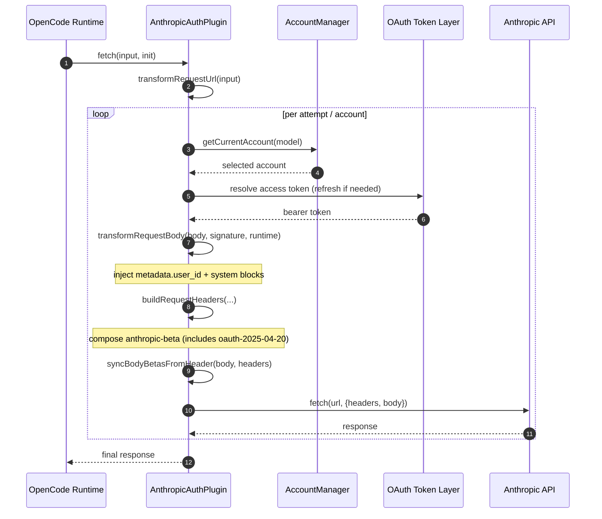

# Detailed Mimicry of HTTP Headers and System Prompt

> **Note on the production wire shape (added at the `0.3.0` dependency bump).**
> The composition that actually goes on the wire now follows the `DEFAULT_PROFILE`
> of `@tormentalabs/claude-code-wire-compat`, which is **Claude Code 2.1.233**
> (`claude-code-2.1.233-sdk-0.112.1`) as of this note. The plugin inherits it by
> omitting the `profile` argument, so a package release can advance it.
>
> **The body of this document remains the verified 2.1.195 decompilation** and is
> still the right reference for how each header and system-prompt segment is
> derived. The 195 → 233 deltas are recorded in the package's `CHANGELOG` and in
> [`claude-code-2.1.233-analysis.md`](claude-code-2.1.233-analysis.md); the ones
> visible on a default turn are the user agent, `x-stainless-package-version`
> (`0.94.0` → `0.112.1`), the billing block's `cc_version`, and the removal of
> `summarize-connector-text-2026-03-13` from the beta registry.

<!-- Last verified against: Claude Code 2.1.195 — DECOMPILED from the real
     linux-x64 native binary (@anthropic-ai/claude-code-linux-x64@2.1.195, Bun-
     embedded JS, carved bundle header "// @bun @bytecode @bun-cjs"). Primary-source
     fingerprints confirmed:
       VERSION    = "2.1.195"
       BUILD_TIME = "2026-06-26T01:00:56Z"
       GIT_SHA    = "4603aa3f2ea164bd0974f82eb413ae7acc99a7ee"
       SDK (PK)   = "0.94.0"                  (wire-verified, no bump from 2.1.159)
       README_URL = "https://code.claude.com/docs/en/overview"  (docs domain change)
     Diff vs 2.1.159 (see docs/claude-code-2.1.195-analysis.md for full detail):
       * Beta registry 24 -> 28: ADDED server-side-fallback-2026-06-01 and
         fallback-credit-2026-06-01 (both opt-in/gated by the refusal-fallback
         feature; NOT on a default /v1/messages turn). NONE retired. These two
         supersede the 2.1.159 x-is-refusal-fallback header experiment.
       * DEFAULT-SET drift the plugin must close: real CC sends
         context-management-2025-06-27 (first-party non-claude-3, incl. Haiku, via
         n0d(model)) AND effort-2025-11-24 (effort-capable models: Opus 4.5/4.6/4.7/4.8,
         Sonnet 4.6) by default. Plugin currently OMITS both -> under-send fingerprint.
       * OAuth token-call client migrated axios -> SDK native fetch provider:
         User-Agent now "anthropic-sdk-typescript/0.94.0 userOAuthProvider" and the
         token POST carries anthropic-beta: oauth-2025-04-20. Plugin still mimics
         axios/1.13.6 + Accept: application/json,text/plain,*/* (lib/oauth.mjs).
         BEHAVIORAL change — test against the 429 guard before adopting.
       * Header wiring: CC re-adds x-client-request-id:<uuid> via first-party
         middleware (plugin DELETES it -> presence drift); new conditional x-cc-atis
         attestation header (unmimicable, server-issued); anthropic-dispatch-id
         experimental (GrowthBook tengu_cedar_lattice, default-off; plugin omits =
         correct); x-stainless-helper NOT present on a genuine main turn (plugin may
         over-send). New optional ", workload/<n>" User-Agent segment (absent in
         normal interactive use). anthropic-dangerous-direct-browser-access:true
         CONFIRMED on wire (dangerouslyAllowBrowser:!0) — plugin matches.
       * OAuth login flow / scopes / client_id / PKCE byte-identical.
       * anthropic-ratelimit-unified-* RESPONSE family expanded (overage/utilization/
         representative-claim/upgrade-paths) — rotation/backoff parsing opportunity.
     Distribution: still a thin npm wrapper that hardlinks a per-platform native Bun
       single-file binary (~225-245MB) from optionalDependencies; no readable cli.js.
     Prior baseline (2.1.159 linux-x64): BUILD_TIME 2026-05-31T16:22:50Z,
       GIT_SHA dd8c11fc8d05cea0b2b9fc8f5a99a5c5c5dffc9b.
     Beta registry: 28 OE("label","flag") frozen entries in array Udd (was 24 rD()
       in 2.1.159; see list below). Helper sets: S2r=bedrock-unsupported filter
       {interleaved_thinking,long_context,tool-search-tool} (matches plugin); E2r=
       countTokens allowlist {claude_code,interleaved_thinking,context_management,oauth};
       Pvi=3rd-party allowlist (no-op for first-party OAuth).
     cc_version 3-char suffix algo CONFIRMED unchanged: sha256(SALT + msg[4]+msg[7]+
       msg[20] + VERSION).slice(0,3), SALT="59cf53e54c78" — plugin matches byte-for-byte.
     Thinking ctx-mgmt: jq_({hasThinking}) => {edits:[{type:"clear_thinking_20251015",
       keep:"all"}]} only when thinking active — plugin matches. -->

> **Wave 3 implementation note:** Mimicry, token-economy, session-metrics, and
> pure retry-decision logic were extracted from `index.mjs` into
> `lib/mimicry/*`, `lib/token-economy/*`, `lib/session-metrics.mjs`, and
> `lib/retry/overload-loop.mjs`. The extraction preserved wire behavior
> byte-for-byte; `index.mjs` remains the effectful fetch/OAuth/retry shell.

## Binary-verified beta registry (2.1.195, 28 entries in `Udd`)

These are the exact `OE("internal_label", "beta-flag")` frozen registrations in the
2.1.195 binary array `Udd` (the constructor/array were `rD(...)` in 2.1.159 — minifier
rename only). The table below shows 26 entries; the two not listed —
`claude_code` (`claude-code-20250219`) and `oauth_auth` (`oauth-2025-04-20`) — are the
two always-present entries handled separately by the plugin (claude_code skipped on
Haiku; oauth always on in OAuth mode). The two NEW vs 2.1.159 are `server_side_fallback`
and `fallback_credit` (marked NEW; both opt-in/gated, see rows). The plugin emits a
subset always-on, gates some on body features (effort, fast-mode, tool-search via
incoming passthrough), and keeps the rest in `EXPERIMENTAL_BETA_FLAGS` as a
disable-guard.

> ⚠ DEFAULT-SET drift (see `docs/claude-code-2.1.195-analysis.md` §5): real CC sends
> `context-management-2025-06-27` and `effort-2025-11-24` by DEFAULT on modern
> first-party models; the plugin currently omits both (under-send). Conversely the
> plugin's always-on `extended-cache-ttl` / `advisor-tool` / `context-hint` are
> GrowthBook/condition-gated in CC (over-send risk). Registry membership ≠ default
> emission — the gating, not the table, is the contract.

| label                   | flag                                                                                                                                                                    |
| ----------------------- | ----------------------------------------------------------------------------------------------------------------------------------------------------------------------- |
| advisor_tool            | advisor-tool-2026-03-01                                                                                                                                                 |
| afk_mode                | afk-mode-2026-01-31                                                                                                                                                     |
| cache_diagnosis         | cache-diagnosis-2026-04-07                                                                                                                                              |
| ccr_byoc                | ccr-byoc-2025-07-29                                                                                                                                                     |
| context_hint            | context-hint-2026-04-09                                                                                                                                                 |
| context_management      | context-management-2025-06-27                                                                                                                                           |
| effort                  | effort-2025-11-24                                                                                                                                                       |
| environments            | environments-2025-11-01                                                                                                                                                 |
| extended_cache_ttl      | extended-cache-ttl-2025-04-11                                                                                                                                           |
| fallback_credit         | fallback-credit-2026-06-01 (NEW 2.1.195; opt-in — client refusal-fallback repricing middleware; NOT on a default turn; plugin keeps OFF)                                |
| files_api               | files-api-2025-04-14                                                                                                                                                    |
| interleaved_thinking    | interleaved-thinking-2025-05-14                                                                                                                                         |
| long_context            | context-1m-2025-08-07                                                                                                                                                   |
| mcp_servers             | mcp-servers-2025-12-04                                                                                                                                                  |
| mid_conversation_system | mid-conversation-system-2026-04-07                                                                                                                                      |
| narration_summaries     | summarize-connector-text-2026-03-13 (NEW 2.1.159; gated by GrowthBook `pewter_owl_header`, stripped in fast-mode; plugin keeps OFF)                                     |
| prompt_caching_scope    | prompt-caching-scope-2026-01-05                                                                                                                                         |
| redact_thinking         | redact-thinking-2026-02-12                                                                                                                                              |
| server_side_fallback    | server-side-fallback-2026-06-01 (NEW 2.1.195; opt-in — only with a `fallbacks:[{model}]` body param; rejected on Batches; n/a Bedrock/Vertex/Foundry; plugin keeps OFF) |
| speed                   | fast-mode-2026-02-01                                                                                                                                                    |
| structured_outputs      | structured-outputs-2025-12-15                                                                                                                                           |
| task_budgets            | task-budgets-2026-03-13                                                                                                                                                 |
| thinking_token_count    | thinking-token-count-2026-05-13                                                                                                                                         |
| tool_search             | advanced-tool-use-2025-11-20                                                                                                                                            |
| tool_search             | tool-search-tool-2025-10-19                                                                                                                                             |
| web_search              | web-search-2025-03-05                                                                                                                                                   |

## Version history (mimicry-relevant changes)

### Context-hint body threshold (2.1.195)

The `context-hint-2026-04-09` beta and the `context_hint` request-body field have
independent emission gates. Once the beta's controller gates pass, the beta is
sent even when the body field is absent. The body is emitted only when clearing
eligible old tool results would save at least `gao = 20000` estimated tokens.

The recovered calculation keeps the newest `Pac = 5` tool-result groups, ignores
results already replaced by `aNn = "[Old tool result content cleared]"` or an
`Ecp = "<persisted-output>"` prefix, estimates text as `Math.round(length / 4)`,
and charges `Acp = 2000` tokens for each image or document block. The genuine
binary additionally filters tool names through `Hcp`; that allowlist remains
unresolved, so the plugin documents the approximation and accepts all tool names
rather than inventing a list.

| CC version | SDK bundled | Beta additions                                                                                                                                                                                                                                                                                                                                                                                       | Beta removals                                                                 | OAuth change                                                                                                                                                                                  |
| ---------- | ----------- | ---------------------------------------------------------------------------------------------------------------------------------------------------------------------------------------------------------------------------------------------------------------------------------------------------------------------------------------------------------------------------------------------------- | ----------------------------------------------------------------------------- | --------------------------------------------------------------------------------------------------------------------------------------------------------------------------------------------- |
| 2.1.195    | 0.94.0      | Registry 24→28: `+ server-side-fallback-2026-06-01`, `+ fallback-credit-2026-06-01` (both opt-in/gated, not default). CONFIRMED default-on for modern first-party models: `context-management-2025-06-27` (`n0d(model)`) + `effort-2025-11-24` (`Kw(model)`) — plugin under-sends both. CC re-adds `x-client-request-id:<uuid>` + conditional `x-cc-atis`. New optional `, workload/<n>` UA segment. | none                                                                          | **Token-call client axios→SDK fetch**: UA `anthropic-sdk-typescript/0.94.0 userOAuthProvider` + `anthropic-beta: oauth-2025-04-20` on token POST. Login flow/scopes/client_id byte-identical. |
| 2.1.159    | 0.94.0      | `summarize-connector-text-2026-03-13` revived as registry label `narration_summaries`, gated by GrowthBook `pewter_owl_header` (default-off) + first-party + non-fast-mode. New header `x-is-refusal-fallback` gated by server `convolute_arcades` (default-off).                                                                                                                                    | none                                                                          | none (byte-identical)                                                                                                                                                                         |
| 2.1.154    | 0.94.0\*    | Opus 4.8 launch (2026-05-28) support: claude-opus-4-8 routed as adaptive-thinking + 1M context + fast-mode eligible                                                                                                                                                                                                                                                                                  | none (vs 2.1.150)                                                             | none                                                                                                                                                                                          |
| 2.1.150    | 0.94.0      | 26-entry registry; redact-thinking-2026-02-12 default ON; extended-cache-ttl + thinking-token-count default ON (plugin)                                                                                                                                                                                                                                                                              | advanced-tool-use, tool-search-tool, fast-mode, effort removed from always-on | none                                                                                                                                                                                          |
| 2.1.143    | 0.81.0      | mid-conversation-system-2026-04-07 (registry only, not auto-on)                                                                                                                                                                                                                                                                                                                                      | none                                                                          | none on wire; client-side refresh telemetry expanded (legacy-lock detect)                                                                                                                     |
| 2.1.133    | 0.81.0      | extended-cache-ttl-2025-04-11, environments-2025-11-01                                                                                                                                                                                                                                                                                                                                               | none                                                                          | none                                                                                                                                                                                          |
| 2.1.119    | 0.81.0      | cache-diagnosis-2026-04-07                                                                                                                                                                                                                                                                                                                                                                           | none                                                                          | none                                                                                                                                                                                          |
| 2.1.117    | 0.81.0      | (baseline for this doc)                                                                                                                                                                                                                                                                                                                                                                              | none                                                                          | none                                                                                                                                                                                          |

### 2.1.155–2.1.159 changes (narration_summaries revival, 2026-05-31)

Verified by diffing the linux-x64 native binaries of 2.1.154 and 2.1.159.

- **`summarize-connector-text-2026-03-13` revived.** It had been a dead/no-op slot
  (`njq=""`/`NHq=""`, then a bare `v76;` statement) since v2.1.90. In 2.1.159 the
  registry gains `rD("narration_summaries","summarize-connector-text-2026-03-13")`
  and the per-request builder's dead slot becomes:

  ```js
  if (_ && t36()) $.push(QY$); // _ = first-party/non-SDK; QY$ = narration_summaries
  // t36() === s36("pewter_owl_header")        // GrowthBook flag, default-off
  // downstream: if (q.type==="disabled" || !!z.fastMode) M = M.filter(b => b !== QY$);
  ```

  So real CC emits it only for first-party accounts where the server-side
  GrowthBook flag `pewter_owl_header` is enabled, and never in fast-mode. **The
  plugin keeps it OFF by default** — emitting it unconditionally would be an
  over-broadcast fingerprint. Same posture as `mid-conversation-system`. The
  earlier plugin behavior of NOT sending `summarize-connector-text` (asserted by
  `test/conformance/regression.test.mjs`) remains correct; the flag is added to
  `EXPERIMENTAL_BETA_FLAGS`/`BETA_SHORTCUTS` only for the disable-guard and manual
  opt-in. If opted in manually, replicate the fast-mode strip.

- **New header `x-is-refusal-fallback`.** Bound to `clientDataCache.convolute_arcades`
  (server-pushed flag, default-off): `ZMK()` returns `clientDataCache?.convolute_arcades===true`.
  A per-request retry marker the server expects only for accounts opted into the
  refusal-fallback experiment. **Plugin omits it** (correct).

- **OAuth unchanged.** `client_id 9d1c250a-e61b-44d9-88ed-5944d1962f5e`, scopes
  `org:create_api_key user:inference user:profile`, `/oauth/token` + `/v1/oauth/token`
  are byte-identical to 2.1.154. No login-flow drift.

- **Stainless / version headers unchanged.** `x-stainless-package-version` still
  `0.94.0` (`NQ="0.94.0"`), `anthropic-version` still `2023-06-01`.

- **New telemetry (no wire impact except as corroboration):**
  `tengu_reorder_tool_uses_skipped_for_thinking` confirms CC reorders `tool_use`
  blocks but skips the reorder when `thinking`/`redacted_thinking` blocks are
  present — exactly the byte-identity contract the plugin already enforces.
  `tengu_byte_stream_idle_timeout_ms` exposes a client-side stream idle-timeout
  (env `*_STREAM_IDLE_TIMEOUT_MS` / GrowthBook) — a robustness parity opportunity,
  not a fingerprint. `tengu_pewter_owl_model` is the same `pewter_owl` family as
  `narration_summaries`.

- **Fingerprints:** `BUILD_TIME 2026-05-31T16:22:50Z`,
  `GIT_SHA dd8c11fc8d05cea0b2b9fc8f5a99a5c5c5dffc9b`. SDK still `0.94.0` (no bump
  across 2.1.155–2.1.159). See `docs/claude-code-2.1.159-analysis.md`.

### mid-conversation-system-2026-04-07 (registered in 2.1.143)

- New beta added to the master `{json_key: beta_header}` registry in 2.1.143
  (`mid_conversation_system -> mid-conversation-system-2026-04-07`).
- Accompanied by telemetry event `tengu_mid_conv_system_fallback_retry` — implies
  the client injects system blocks mid-conversation (not just leading), with a
  fallback-and-retry path when the server refuses.
- NOT in always-on emission code paths; only appears at the registry site and
  inside the gated bundle block. Likely GrowthBook-gated until server rollout
  completes.
- Plugin support: should be listed in `EXPERIMENTAL_BETA_FLAGS` for forward
  compat; should NOT be added to always-on emission set.

### 2.1.151–2.1.154 changes (Opus 4.8 launch, 2026-05-28)

- **`claude-opus-4-8`** is a new adaptive-thinking model (successor to 4.7). The
  plugin detects it via `isOpus48Model()` in `lib/mimicry/models.mjs` and routes
  it identically to 4.6/4.7 for thinking, effort, 1M context, and
  simple-system-prompt eligibility.
- **Adaptive thinking is mandatory.** Manual `thinking: {type:"enabled",
budget_tokens:N}` returns a **400** on Opus 4.7 AND 4.8. The plugin's
  `normalizeThinkingBlock()` in `lib/mimicry/models.mjs` converts any incoming manual thinking to
  `{type:"adaptive"}` for these models; top-level `effort` is moved into
  `output_config.effort` (default `high` for Pro/Max).
- **Fast mode.** Per Anthropic fast-mode docs, `speed:"fast"` (beta
  `fast-mode-2026-02-01`) is a research preview supported on Opus 4.6, 4.7,
  **and** 4.8. Opus 4.7 is the `/fast` default in real Claude Code v2.1.142+.
  The plugin injects `speed:"fast"` for all three Opus models (4.6/4.7/4.8) when
  fast mode is enabled; Sonnet is not eligible. Switching `speed` invalidates
  system + message prompt caches, so it is only flipped deliberately.
- **Pricing.** Opus 4.8 is `$5 / $25` per 1M (input/output), cheaper than 4.6/4.7
  (`$15 / $75`). Added to `MODEL_PRICING`.
- **\*SDK version note.** Since 2.1.x, the `@anthropic-ai/claude-code` npm package
  is a thin wrapper that ships a **native binary** (no JS `cli.js` bundle). The
  bundled Anthropic SDK version can no longer be string-extracted, so the plugin
  carries `0.94.0` forward for 2.1.151–2.1.154 (no SDK bump observed). Revisit if
  a future release exposes a different `x-stainless-package-version` on the wire.

### Thinking-block round-trip contract (CRITICAL — applies to all adaptive models)

`thinking` and `redacted_thinking` blocks MUST be returned to the API
**byte-identical** to the model's original response (signature/data intact,
order preserved). ANY mutation triggers:

> `400 ... thinking or redacted_thinking blocks in the latest assistant message
cannot be modified. These blocks must remain as they were in the original
response.`

The plugin's per-message `cache_control` strip loop therefore **skips**
`thinking`/`redacted_thinking` blocks entirely — it never deletes nor adds
`cache_control` on them (`cache_control` is not a valid field on a thinking
block in the first place). The `cache_control` breakpoint is placed only on the
last **user**-message block. This guard is model-agnostic but is what makes Opus
4.6/4.7/4.8 + Sonnet 4.6 tool-continuation turns work.

### 2.1.150 wire-level changes (non-beta)

- `x-stainless-package-version` bumped to `0.94.0` (was `0.81.0`) — SDK version in stainless headers.
- `x-anthropic-additional-protection: true` confirmed as conditional header (set when `CLAUDE_CODE_ADDITIONAL_PROTECTION=1`).
- Beta set restructured: 26-entry registry with 4 betas removed from always-on
  (`advanced-tool-use-2025-11-20`, `tool-search-tool-2025-10-19`, `fast-mode-2026-02-01`, `effort-2025-11-24`).
- `redact-thinking-2026-02-12` is default ON for first-party, non-SDK requests (matching CC 2.1.150). Opt out via `/anthropic set redact-thinking off`.
- `context-management-2025-06-27` is hardcoded `&& false` in CC D5q (effectively disabled).
- `structured-outputs-2025-12-15` depends on the caller supplying an output format; `tengu_tool_pear` instead gates `tool.strict = true` on the tool-schema path.
- Billing header format, `anthropic-version`, OAuth constants: byte-identical to 2.1.143.
- See `claude-code-2.1.150-analysis.md` for full 26-entry beta registry and D5q assembly logic.

### 2.1.143 wire-level changes (non-beta)

- Two new optional `x-` headers when in subagent context:
  `x-claude-code-agent-id`, `x-claude-code-parent-agent-id`. Emitted by real CC
  only when a subagent dispatches; absence on main-thread is correct.
- `anthropic-version` still `2023-06-01`.
- All stainless headers, OAuth constants, model registry, billing header format
  (`cc_version=...; cc_entrypoint=...; cch=00000; [cc_workload=...;]`) are
  byte-identical to 2.1.133.
- The `cc_workload=` billing segment and the `CLAUDE_CODE_SIMPLE_SYSTEM_PROMPT`
  simple-prompt mode for Opus 4.7+ were already present in 2.1.133 — prior
  analysis did not surface them. See `claude-code-2.1.143-analysis.md` § 6.1.

### cache-diagnosis-2026-04-07 (added in 2.1.119)

- Flag constant: `SeH = "cache-diagnosis-2026-04-07"`.
- NOT always-on. Gated by GrowthBook flag `tengu_prompt_cache_diagnostics` (default `false`).
- Eligibility guard observed upstream: account type must be `firstParty` (standard CC OAuth) or
  `anthropicAws` without `ANTHROPIC_AWS_BASE_URL` override; fails silently if neither. This plugin
  targets first-party OAuth only, so the `anthropicAws` branch is documented for parity but is out
  of operational scope here.
- When active, the request builder appends `cache-diagnosis-2026-04-07` to `anthropic-beta`
  and injects `{ diagnostics: { previous_message_id: <id> } }` only when all of the following
  hold: beta active, previous_message_id known, conversation is live, and not in zero-shot mode.
- Retry path: if the server returns HTTP 400 and the response body mentions both
  `cache-diagnosis-2026-04-07` and `anthropic-beta`, the latch is cleared and the request
  is retried without the beta.
- Plugin support: listed in `EXPERIMENTAL_BETA_FLAGS`; shortcuts `cache-diagnosis` and
  `cache-diag` are registered in `BETA_SHORTCUTS`. NOT included in any always-on header list.

### extended-cache-ttl-2025-04-11 (found in 2.1.133)

- New beta for extended cache TTL duration.
- NOT always-on. Likely gated by a GrowthBook feature flag (flag name unknown).
- When active, extends the TTL for prompt cache entries beyond the default.
- Plugin support: listed in `EXPERIMENTAL_BETA_FLAGS`; shortcuts `extended-cache-ttl` and
  `cache-ttl` are registered in `BETA_SHORTCUTS`. NOT included in any always-on header list.

### environments-2025-11-01 (found in 2.1.133)

- New environments support beta.
- NOT always-on. Purpose and gating mechanism unknown from binary analysis.
- Plugin support: listed in `EXPERIMENTAL_BETA_FLAGS`. NOT included in any always-on header list.

### context_management edit type compact_20260112 (found in 2.1.133)

- New `context_management.edits` type `compact_20260112` found alongside existing `clear_thinking_20251015`.
- Used during full server-side context compaction (not just thinking management).
- Plugin currently injects `clear_thinking_20251015` only, which remains valid.
- Not a fingerprint drift since the plugin doesn't trigger server-side compaction flows.

This document explains, at implementation level, how the plugin mimics Claude Code signature behavior for Anthropic requests, with focus on:

- HTTP header composition
- `system` composition in the request body
- related auxiliary fields (`metadata`, `betas`, URL shaping, and toggles)

Primary code references:

- `index.mjs` (effectful fetch interceptor, OAuth flow, and retry shell)
- `lib/mimicry/headers.mjs`
- `lib/mimicry/request-body.mjs`
- `lib/mimicry/response-stream.mjs`
- `lib/mimicry/system-prompt.mjs`
- `lib/mimicry/models.mjs`
- `lib/mimicry/cache.mjs`
- `lib/mimicry/request-helpers.mjs`
- `lib/token-economy/transforms.mjs`
- `lib/token-economy/microcompact.mjs`
- `lib/session-metrics.mjs`
- `lib/retry/overload-loop.mjs`
- `lib/config.mjs`

## 1) Control switch (on/off)

Mimicry is controlled by `signature_emulation`:

```jsonc
{
  "signature_emulation": {
    "enabled": true,
    "fetch_claude_code_version_on_startup": true,
    "prompt_compaction": "minimal",
  },
}
```

Environment overrides (in `lib/config.mjs`):

- `OPENCODE_ANTHROPIC_EMULATE_CLAUDE_CODE_SIGNATURE`
  - `1/true` => enabled
  - `0/false` => disabled
- `OPENCODE_ANTHROPIC_FETCH_CLAUDE_CODE_VERSION`
  - `1/true` => fetch latest `@anthropic-ai/claude-code` version on startup
  - `0/false` => keep internal fallback version
- `OPENCODE_ANTHROPIC_PROMPT_COMPACTION`
  - `minimal` => compact long system instruction blocks (default)
  - `off` => disable compaction

### 1.1) What `enabled: false` means (Phase 2.2.2 onwards)

**Off means OFF — pure passthrough plus the auth envelope.** No mimicry function composes the request: it is built by
`lib/passthrough-headers.mjs`, which lives outside `lib/mimicry/` on purpose. The outgoing request is the host's own
request, with exactly three modifications:

| Modification                                      | Why it is transport, not mimicry                                                                                                                                                                                                                                           |
| ------------------------------------------------- | -------------------------------------------------------------------------------------------------------------------------------------------------------------------------------------------------------------------------------------------------------------------------- |
| `authorization: Bearer <account token>`           | The plugin _is_ an OAuth transport. Without it there is no request and no account rotation.                                                                                                                                                                                |
| `anthropic-beta`: **additive** `oauth-2025-04-20` | The host's value is preserved verbatim, in its own order; the OAuth beta is appended only when missing. It is a contract of the OAuth token, not a fingerprint — the API rejects a bearer without it (see [RE §14.2 item 3, §14.3](./claude-code-reverse-engineering.md)). |
| `x-api-key` and `x-session-affinity` removed      | A competing credential must not travel next to our bearer; the opencode SDK's affinity hint leaks session identity upstream. Envelope hygiene.                                                                                                                             |

Everything else is untouched, `user-agent` above all. Headers that are **not** sent with emulation off:
the forged `claude-cli` user-agent, `anthropic-version`, `x-app`, `x-claude-code-session-id`, `x-client-request-id`,
`anthropic-dangerous-direct-browser-access`, and the whole `x-stainless-*` family.

The body is not transformed either — `transformRequestBody` does not run. Two strips remain, because they keep the
request _valid_ rather than making it look like Claude Code: the body-level `betas` field (never a first-party field;
the API answers "Extra inputs are not permitted") and the host's stainless-helper markers (a host-side signal the API
has never known, rejected inside a tool definition).

BEFORE Phase 2.2.2 this switch produced HALF-mimicry: a forged `claude-cli/2.1.233 (external, cli)` user-agent, an
`anthropic-beta` that REPLACED the host's, and `transformRequestBody`'s non-gated normalizations (which also emptied
the host's `system` and injected a `temperature` the host never sent). Pinned by
`test/conformance/shared-package-parity.test.mjs` ("emulation-off passthrough envelope") and wire-baseline
vector 09.

The system-prompt side is unchanged: with emulation off the plugin uses the legacy system-prompt transform path
(Claude Code prefix via `experimental.chat.system.transform`) and applies none of the header/system mimicry documented
below.

## 2) Claude CLI version used in signature behavior

In `AnthropicAuthPlugin`:

- initial fallback version: `2.1.2`
- if `fetch_claude_code_version_on_startup=true`, it performs GET on:
  - `https://registry.npmjs.org/@anthropic-ai/claude-code/latest`
- short timeout (AbortController); failures are silent and fallback remains active

This version is used by:

- `user-agent`
- `x-stainless-package-version`
- `x-anthropic-billing-header` generation in `system`

## 3) Request flow where mimicry is applied

Inside `auth.loader().fetch(...)`:

1. transform URL (`transformRequestUrl`) — the legacy-path URL, and the URL the eligibility gate reads
2. select account and resolve token (including refresh when needed)
3. transform body (`transformRequestBody` in `lib/mimicry/request-body.mjs`) with runtime context
4. build headers (`buildRequestHeaders` in `lib/mimicry/headers.mjs`), or, on the adapter path, headers + body + URL from the shared package
5. execute `fetch` (adapter path: host origin + the package's path and query)

Important: body transform happens per-attempt/per-account (not only once), so `metadata.user_id` includes the actual `accountId` in use for that attempt.

### 3.1 Protocol sequence diagram (Mermaid)


```mermaid
sequenceDiagram
    autonumber
    participant Client as OpenCode Runtime
    participant Plugin as AnthropicAuthPlugin
    participant Account as AccountManager
    participant OAuth as OAuth Token Layer
    participant API as Anthropic API

    Client->>Plugin: fetch(input, init)
    Plugin->>Plugin: transformRequestUrl(input)

    loop per attempt / account
        Plugin->>Account: getCurrentAccount(model)
        Account-->>Plugin: selected account

        Plugin->>OAuth: resolve access token (refresh if needed)
        OAuth-->>Plugin: bearer token

        Plugin->>Plugin: transformRequestBody(body, signature, runtime)
        Note over Plugin: inject metadata.user_id + system blocks

        Plugin->>Plugin: buildRequestHeaders(...)
        Note over Plugin: compose anthropic-beta (includes oauth-2025-04-20)

        Plugin->>Plugin: syncBodyBetasFromHeader(body, headers)
        Plugin->>API: fetch(url, {headers, body})
        API-->>Plugin: response
    end

    Plugin-->>Client: final response
```

## 4) HTTP header mimicry

### 4.1 Headers always applied

`buildRequestHeaders(...)` in `lib/mimicry/headers.mjs` always ensures:

- `authorization: Bearer <token>`
  - default token: account OAuth access token
  - optional override: `ANTHROPIC_AUTH_TOKEN` (if set, takes precedence)
- `anthropic-beta: <final beta list>`
- `user-agent: claude-cli/<version> (external, <entrypoint>[, agent-sdk/<v>][, client-app/<app>])`
  - `entrypoint`: `CLAUDE_CODE_ENTRYPOINT` or `cli`
  - optional suffixes:
    - `CLAUDE_AGENT_SDK_VERSION`
    - `CLAUDE_AGENT_SDK_CLIENT_APP`
- always removes `x-api-key`

### 4.2 Extra headers when mimicry is enabled

With `signature.enabled=true`, it adds:

- `anthropic-version: 2023-06-01`
- `x-app: cli` (or `cli-bg` when `CLAUDE_CODE_BACKGROUND=1`)
- `X-Claude-Code-Session-Id: <sessionId>` (same UUID as `metadata.user_id.session_id`)
- `x-stainless-arch: <x64|arm64|...>`
- `x-stainless-lang: js`
- `x-stainless-os: <macOS|Windows|Linux|...>`
- `x-stainless-package-version: <sdkVersion>` (Anthropic SDK version, e.g. `0.208.0`)
- `x-stainless-runtime: node`
- `x-stainless-runtime-version: <process.version>`
- `x-stainless-retry-count`
  - preserves incoming value when present and not explicitly falsy
  - otherwise sets `0`
- `x-stainless-helper`
  - extracted dynamically from `tools`/`messages` in body
  - scans keys: `x_stainless_helper`, `x-stainless-helper`, `stainless_helper`, `stainlessHelper`, `_stainless_helper`
  - aggregates unique values as comma-separated list

It also injects optional env-driven headers:

- `ANTHROPIC_CUSTOM_HEADERS` (multiline `Header-Name: value`)
  - each valid line is converted into a header
- `CLAUDE_CODE_CONTAINER_ID` => `x-claude-remote-container-id`
- `CLAUDE_CODE_REMOTE_SESSION_ID` => `x-claude-remote-session-id`
- `CLAUDE_AGENT_SDK_CLIENT_APP` => `x-client-app`
- `CLAUDE_CODE_ADDITIONAL_PROTECTION=1/true/yes` => `x-anthropic-additional-protection: true`
- `x-client-request-id: <uuid>` (v2.1.84+, unique per request for debugging stream timeouts)
  - ⚠ 2.1.195: CC's first-party fetch middleware (`Ukd`) sets `x-client-request-id`
    to `crypto.randomUUID()` on **every** first-party request when absent. If the
    plugin currently strips/omits it (see `lib/mimicry/headers.mjs`), that is a presence/
    absence drift — CC always carries this header. Re-emit a random UUID. See
    `docs/claude-code-2.1.195-analysis.md` §7.

### 4.3 OAuth token-layer user-agent mimicry

OAuth token calls (`POST /v1/oauth/token`, exchange and refresh) now default to
Claude Code 2.1.195's SDK native-fetch OAuth-provider fingerprint
(`userOAuthProvider`). This is controlled by the config flag
`oauth.sdk_token_useragent`, which **defaults to `true`**.

Headers sent by default (flag `true`, matching CC 2.1.195):

- `User-Agent: anthropic-sdk-typescript/0.94.0 userOAuthProvider`
- `anthropic-beta: oauth-2025-04-20` ← new on the token endpoint
- `Content-Type: application/json`
- (no explicit `Accept` — native `fetch` default)

Set `oauth.sdk_token_useragent` to `false` to revert to the legacy axios
fingerprint (byte-identical to the historical CLI):

- `User-Agent: axios/1.13.6`
- `Accept: application/json, text/plain, */*`
- `Content-Type: application/json`

> ✅ **RE-CONVERGED — Claude Code 2.1.195 (see `docs/claude-code-2.1.195-analysis.md` §6).**
> Upstream CC migrated the OAuth token client from axios to the Anthropic TS SDK's
> native fetch OAuth provider (`userOAuthProvider`). The plugin now matches this by
> default (`oauth.sdk_token_useragent` default `true`). Historically the token
> endpoint 429'd requests lacking the axios UA; that risk is accepted for the
> default-on path. Set the flag to `false` to fall back to the byte-identical
> `axios/1.13.6` + `Accept: application/json, text/plain, */*` fingerprint if a
> live refresh ever regresses.

### 4.4 WebFetch user-agent (intentional divergence)

**Design decision:** The plugin intentionally does NOT use Claude Code's `Claude-User` UA for web scraping.

Claude Code v2.1.84 sends: `Claude-User (claude-code/{version}; +https://support.anthropic.com/)`

The plugin instead sends a standard Chrome browser User-Agent. Rationale:

1. `Claude-User` self-identifies as an AI bot, causing many sites to block or degrade responses
2. A Chrome UA gets past virtually all bot-detection (robots.txt, Cloudflare AI rules, WAFs)
3. The WebFetch UA is client-side only — Anthropic cannot observe it on their API endpoints
4. This produces materially better web scraping results for end users

## 5) Beta header catalog (Claude Code reference vs current plugin)

### 5.1 Beta composition rule in the plugin

Function in `lib/mimicry/headers.mjs`:
`buildAnthropicBetaHeader(incomingBeta, signatureEnabled, model, provider, customBetas, strategy, requestPath, hasFileReferences)`

- starts with `oauth-2025-04-20`
- preserves incoming betas (`incomingBeta`) and deduplicates on merge
- accepts `strategy` (`"sticky"`, `"round-robin"`, `"hybrid"`) to conditionally exclude stateful betas
- applies endpoint/content-aware betas using `requestPath` and `hasFileReferences`

When `signatureEnabled=false`: **this builder is no longer reached from the interceptor.** As of Phase 2.2.2 a request
with signature emulation off is built by `lib/passthrough-headers.mjs` and never by a mimicry function, so the
`signatureEnabled=false` branch below survives only for direct callers and tests. What the wire actually gets is the
host's `anthropic-beta` verbatim with `oauth-2025-04-20` appended when missing — see §1 and
[README](../README.md#signature-emulation).

The dead branch, for reference:

- added `interleaved-thinking-2025-05-14` (in addition to OAuth beta)
- added `token-counting-2024-11-01` for `/v1/messages/count_tokens`

> **`/v1/messages/count_tokens` with `signatureEnabled=true` no longer uses this builder.** That route is composed by
> the shared package's count surface (`buildClaudeCodeCountTokensRequest`), which derives its own beta set from the
> model, appends `token-counting-2024-11-01` itself, and emits a body of `{model, messages, tools}` with no `system`,
> `metadata` or `max_tokens`. The list below therefore describes the `/v1/messages` route and the emulation-off count
> route. See [`mimicry/wire-compat-divergences.md`](./mimicry/wire-compat-divergences.md) for the measured diff.

When `signatureEnabled=true`, current implementation may add dynamically:

- `claude-code-20250219` (not added for Haiku models)
- `files-api-2025-04-14` (only for `/v1/files` or when body references `file_id`)
- `interleaved-thinking-2025-05-14` (if model supports it and not disabled by `DISABLE_INTERLEAVED_THINKING`)
- `context-1m-2025-08-07` (if model indicates 1M context)
- `redact-thinking-2026-02-12` (**default ON** — matches CC 2.1.150; opt out via `/anthropic set redact-thinking off` or `token_economy.redact_thinking = false`)
- `context-management-2025-06-27` (opt-in via `token_economy.context_management`; hardcoded `&& false` in CC 2.1.150 D5q)
- `structured-outputs-2025-12-15` (opt-in via `token_economy.structured_outputs`; enabled by a caller-supplied output format in CC)
- `web-search-2025-03-05` (added on supported models; the plugin gates on the model only — upstream additionally gates on provider `vertex`/`foundry`)
- `prompt-caching-scope-2026-01-05` (non-interactive mode; **skipped in round-robin** — cache is per-workspace)
- `extended-cache-ttl-2025-04-11` (default ON; extended prompt cache TTL — plugin addition for better cache rates)
- `thinking-token-count-2026-05-13` (default ON; token tracking — plugin addition via `token_economy.thinking_token_count`)
- `token-counting-2024-11-01` (for `/v1/messages/count_tokens`)
- additional betas from `ANTHROPIC_BETAS` (all models, including Haiku)
- `custom_betas` from config

Experimental beta safety switch:

- if `CLAUDE_CODE_DISABLE_EXPERIMENTAL_BETAS=1/true/yes`, known experimental betas are stripped from the final header
- this mirrors Claude Code's gateway-safety behavior used to avoid validation regressions on some routes/providers

Strategy filter:

- if `strategy` is `"round-robin"`, the following betas are excluded to avoid per-account state conflicts:
  - `prompt-caching-scope-2026-01-05` (cache is per-workspace)
- the `OPENCODE_ANTHROPIC_INITIAL_ACCOUNT` env var overrides the strategy to `sticky` for the session, re-enabling strategy-sensitive auto betas

Provider filter:

- **None.** The plugin applies no provider-based filtering to the beta set. `buildAnthropicBetaHeader()`
  takes no `provider` argument and `BEDROCK_UNSUPPORTED_BETAS` does not exist in this codebase (its
  absence is pinned by `lib/mimicry/headers.test.mjs`).
- Upstream reference: the official client removes betas listed in its `BEDROCK_UNSUPPORTED_BETAS` set
  (including `code-execution-2025-08-25` and `files-api-2025-04-14`) when the detected provider is
  `bedrock`, detecting the provider from the request URL hostname (`anthropic`, `bedrock`, `vertex`,
  `foundry`). The plugin is Anthropic first-party only and never takes that path — see
  [Provider Scope](../README.md#provider-scope).

### 5.2 Claude Code reference beta list (consolidated)

Automatically enabled by Claude Code 2.1.150 (D5q builder, first-party OAuth, non-haiku):

- `claude-code-20250219`
- `oauth-2025-04-20`
- `interleaved-thinking-2025-05-14` (thinking models)
- `context-1m-2025-08-07` (long-context models)
- `redact-thinking-2026-02-12` (default ON — first-party, non-SDK; opt-out via `/anthropic set redact-thinking off`)
- `prompt-caching-scope-2026-01-05` (first-party only)
- `token-counting-2024-11-01` (preflight `/v1/messages/count_tokens`)
- `task-budgets-2026-03-13` (conditional on task budget presence)

Feature-flagged in CC 2.1.150 (NOT default; opt-in or flag-gated):

- `context-management-2025-06-27` (hardcoded `&& false` in D5q — effectively disabled)
- `structured-outputs-2025-12-15` (enabled when the caller supplies an output format; `tengu_tool_pear` gates tool-schema strictness)
- `thinking-token-count-2026-05-13` (behind `tengu_chert_bezel` flag)
- `extended-cache-ttl-2025-04-11` (not default in CC, but default ON as plugin addition)
- `environments-2025-11-01` (feature-flagged)

Removed from CC always-on in 2.1.150 (were in prior versions):

- `advanced-tool-use-2025-11-20` — no longer always-on in CC; available via `ANTHROPIC_BETAS`
- `tool-search-tool-2025-10-19` — no longer always-on in CC; available via `ANTHROPIC_BETAS`
- `fast-mode-2026-02-01` — no longer always-on in CC; **auto-emitted by the plugin** when `speed:"fast"` is in the outgoing body (structural lockstep). Available via `ANTHROPIC_BETAS` for manual opt-in without fast_mode config.
- `effort-2025-11-24` — no longer always-on in CC; available via `ANTHROPIC_BETAS`

Now auto-included by the plugin (CC 2.1.150 parity + plugin additions):

- `redact-thinking-2026-02-12` (**default ON** — opt-out via `/anthropic set redact-thinking off`; matches CC 2.1.150)
- `extended-cache-ttl-2025-04-11` (default ON; plugin addition for better cache rates)
- `thinking-token-count-2026-05-13` (default ON; plugin addition for token tracking)
- `files-api-2025-04-14` (only `/v1/files` and Messages requests that reference `file_id`)
- `token-counting-2024-11-01` (preflight `/v1/messages/count_tokens`)

Available via `/anthropic betas add` or `ANTHROPIC_BETAS`:

- `message-batches-2024-09-24`
- `compact-2026-01-12`
- `mcp-servers-2025-12-04`
- `code-execution-2025-08-25`
- `extended-cache-ttl-2025-04-11`
- `environments-2025-11-01`

Platform-specific betas (not cross-provider defaults):

- `bedrock-2023-05-31`
- `vertex-2023-10-16`
- `oauth-2025-04-20`
- `ccr-byoc-2025-07-29`

### 5.3 Current plugin gaps vs reference

Newly auto-included (CC 2.1.150 parity):

- `redact-thinking-2026-02-12` (**default ON** — matches CC 2.1.150; opt-out via `/anthropic set redact-thinking off`)
- `extended-cache-ttl-2025-04-11` (default ON; plugin addition)
- `thinking-token-count-2026-05-13` (default ON; plugin addition)

Newly auto-included in v0.0.38 (prior):

- `token-efficient-tools-2026-03-28` (default on, `config.token_economy.token_efficient_tools`)
- `summarize-connector-text-2026-03-13` (default on, `config.token_economy.connector_text_summarization`)

Removed from always-on (CC 2.1.150 parity):

- `advanced-tool-use-2025-11-20` — removed from always-on; available via `ANTHROPIC_BETAS` or `/anthropic betas add`
- `tool-search-tool-2025-10-19` — removed from always-on; available via `ANTHROPIC_BETAS`
- `fast-mode-2026-02-01` — removed from always-on; available via `ANTHROPIC_BETAS`
- `effort-2025-11-24` — removed from always-on; available via `ANTHROPIC_BETAS`

No dedicated automatic composition yet for:

- `afk-mode-2026-01-31` (transcript classifier — ant-only)
- `advisor-tool-2026-03-01` (v2.1.84+ — feature-flagged, niche)
- `cli-internal-2026-02-09` (ant-only)

`task-budgets-2026-03-13` is available as a BETA_SHORTCUTS shortcut (`task-budgets` / `budgets`) and propagates `output_config` body injection when active.

CC 2.1.150 beta registry (26 entries) is documented in full in `docs/claude-code-2.1.150-analysis.md`.

Remaining gaps can be injected manually through `ANTHROPIC_BETAS` or `/anthropic betas add` when operationally required.

**Removed in v2.1.87:** `tool-examples-2025-10-29` is no longer in the always-on beta list. It was present from v2.1.79 through v2.1.86.

### 5.4 Important note on fine-grained tool streaming

In Claude Code, `fine-grained-tool-streaming` is primarily modeled through tool fields (`eager_input_streaming=true`) and feature/env flags, not as a mandatory beta header dependency.

This plugin no longer auto-includes `fine-grained-tool-streaming-2025-05-14` in the default beta header, matching the current reference behavior more closely.

## 6) System prompt mimicry

### 6.1 Block normalization

`normalizeSystemTextBlocks(system)` in `lib/mimicry/system-prompt.mjs` converts
`system` into an array of objects:

- strings become `{ type: "text", text: "..." }`
- objects with string `text` are preserved
- preserves `cache_control` when present

### 6.2 Text sanitization

`sanitizeSystemText(text)` in `lib/mimicry/system-prompt.mjs` applies:

- `OpenCode` => `Claude Code`
- `opencode`/`OpenCode` variants => `Claude`
  - except when preceded by `/` (path-like occurrence preserved)

### 6.3 Identity string selection

`getCLISyspromptPrefix()` selects the identity string dynamically, matching the real CC's `getCLISyspromptPrefix()` (src/constants/system.ts:24-40):

| Condition                                                                                                   | Identity string                                                                                  |
| ----------------------------------------------------------------------------------------------------------- | ------------------------------------------------------------------------------------------------ |
| Default (interactive CLI)                                                                                   | `You are Claude Code, Anthropic's official CLI for Claude.`                                      |
| Agent SDK with CC preset (`CLAUDE_AGENT_SDK_VERSION` set + `CLAUDE_CODE_ENTRYPOINT` = `agent-sdk` or `sdk`) | `You are Claude Code, Anthropic's official CLI for Claude, running within the Claude Agent SDK.` |
| Agent SDK without CC entrypoint (`CLAUDE_AGENT_SDK_VERSION` set, no `CLAUDE_CODE_ENTRYPOINT`)               | `You are a Claude agent, built on Anthropic's Claude Agent SDK.`                                 |

All three values are tracked in `KNOWN_IDENTITY_STRINGS` for deduplication during block filtering.

### 6.4 Cache scoping architecture

`buildSystemPromptBlocks(...)` in `lib/mimicry/system-prompt.mjs` now mirrors the
real CC's three-path cache scoping strategy (src/utils/api.ts
`splitSysPromptPrefix()`):

1. Sanitizes and filters all blocks (removes pre-existing billing headers and identity strings)
2. Delegates to `splitSysPromptPrefix()` which assigns a `cacheScope` to each block
3. Converts scoped blocks to wire format via `getCacheControlForScope()`

#### Cache scope to wire format (`getCacheControlForScope`)

Mirrors real CC `getCacheControl()` (src/services/api/claude.ts:358-374):

| `cacheScope` | Wire `cache_control`                              | Notes                                      |
| ------------ | ------------------------------------------------- | ------------------------------------------ |
| `null`       | _(field omitted)_                                 | Block is never cached                      |
| `'org'`      | `{type: "ephemeral", ttl: "1h"}`                  | Internal scope — `scope` field NOT on wire |
| `'global'`   | `{type: "ephemeral", scope: "global", ttl: "1h"}` | Only scope that appears on wire            |

TTL is controlled by `cache_policy.ttl` config (default `"1h"`). When `ttl: "off"` or `ttl_supported: false`, the `ttl` field is omitted.

**Role-scoped TTL applies to system blocks too (request-wide consistency).** The
TTL written here is not the raw `cache_policy.ttl`; it is the **resolved** TTL
from `resolveCacheTtl()` in `lib/mimicry/cache.mjs` — the same value stamped on the tool and message
breakpoints. For the main interactive thread it stays `"1h"`; for subagent
requests (marked by opencode with the `x-parent-session-id` header) and other
non-main roles (`title`/`small`/`empty`) with role-scoping enabled, it
downgrades to `"5m"`. This is required because Anthropic processes
`cache_control` blocks in the order **`tools` → `system` → `messages`** and
rejects any `ttl: "1h"` block that comes **after** a `ttl: "5m"` block
(`"a ttl='1h' cache_control block must not come after a ttl='5m' cache_control
block"`). Keeping system, tools, and messages on one resolved TTL mirrors real
CC, which derives a single TTL per `querySource`, and prevents the
5m-tools-then-1h-system ordering violation that previously fired on every
subagent delegation. The `ttl: "1h"` values in the tables below are the
main-thread case; substitute `"5m"` for non-main/subagent requests.

#### Path selection (`splitSysPromptPrefix`)

The real CC has 3 code paths. Paths A and C produce identical wire output, so the plugin implements 2 effective paths:

**Path B — Boundary mode** (when `cache_policy.boundary_marker=true` or `CLAUDE_CODE_FORCE_GLOBAL_CACHE=1`):

Activated when the boundary marker `__SYSTEM_PROMPT_DYNAMIC_BOUNDARY__` is found in the system prompt array.

| Block                                               | `cacheScope` | Wire `cache_control`                              |
| --------------------------------------------------- | ------------ | ------------------------------------------------- |
| Attribution header                                  | `null`       | _(omitted)_                                       |
| Identity string                                     | `null`       | _(omitted)_                                       |
| Static blocks (before boundary, joined with `\n\n`) | `'global'`   | `{type: "ephemeral", scope: "global", ttl: "1h"}` |
| Dynamic blocks (after boundary, joined with `\n\n`) | `null`       | _(omitted)_                                       |

Boundary detection uses **exact marker match** (`block.text === SYSTEM_PROMPT_DYNAMIC_BOUNDARY`), not heuristic string search. If the marker is not found, falls through to default mode.

**Path C — Default mode** (no boundary marker, or boundary mode disabled):

Covers both the real CC's "fallback" path and "tool-based cache" path, which produce identical wire formats.

| Block                            | `cacheScope` | Wire `cache_control`             |
| -------------------------------- | ------------ | -------------------------------- |
| Attribution header               | `null`       | _(omitted)_                      |
| Identity string                  | `'org'`      | `{type: "ephemeral", ttl: "1h"}` |
| Rest blocks (joined with `\n\n`) | `'org'`      | `{type: "ephemeral", ttl: "1h"}` |

#### Block joining

In both paths, user system blocks are joined with `\n\n` into a single text block. This matches the real CC behavior where `rest.join('\n\n')` / `staticBlocks.join('\n\n')` / `dynamicBlocks.join('\n\n')` produce at most one block per scope. Sending separate blocks per original input would be a detectable fingerprinting signal.

### 6.5 Billing header generation

`buildAnthropicBillingHeader(version, firstUserMessage, workloadOverride)`:

- can be disabled by `CLAUDE_CODE_ATTRIBUTION_HEADER=0/false/no`
- `cc_version` suffix is a 3-char fingerprint hash computed from the first user message:
  `SHA256(salt + msg[4] + msg[7] + msg[20] + version)[:3]` (matching real CC `computeFingerprint()`)
- `cch=00000` is always the static placeholder — xxHash64 attestation was **removed in v2.1.97**.
  It is emitted **unconditionally**: the function takes no `provider` argument and there is no
  provider gate. See [Provider Scope](../README.md#provider-scope).
- builds:

```text
x-anthropic-billing-header: cc_version=<version>.<3-char-fingerprint>; cc_entrypoint=<entrypoint>; cch=00000;
```

Upstream reference only — the official client omits `cch` for the bedrock/anthropicAws/mantle
providers, producing the shape below. The plugin never emits this variant:

```text
x-anthropic-billing-header: cc_version=<version>.<3-char-fingerprint>; cc_entrypoint=<entrypoint>;
```

Detail: `cc_entrypoint` uses `CLAUDE_CODE_ENTRYPOINT` or `cli`.
Optional `cc_workload` is appended when `signature_emulation.workload` or `CLAUDE_CODE_WORKLOAD` is set.

### 6.6 CCH Attestation (Removed in v2.1.97)

> **Historical note:** This section documents the CCH attestation mechanism that was active in Claude Code v2.1.96 and earlier. It was **completely removed in v2.1.97**. The `cch` field is now always the static placeholder `00000` and the plugin no longer computes or injects any hash value.

**Previous Algorithm (v2.1.96 and earlier):**

1. Compute xxHash64 over the full serialized JSON body with placeholder `"cch":"00000"`
2. Use seed: `0x6E52736AC806831E` (v2.1.96 seed)
3. Mask result to 20 bits: `hash & 0xFFFFF`
4. Format as 5-char zero-padded hex string
5. Replace placeholder in body before sending to API

**Current Behavior (v2.1.97+):**

- `cch=00000` is always sent as-is — the server no longer validates the hash value
- The `xxhash-wasm` dependency has been removed from the plugin
- `computeAndReplaceCch()` function has been removed

**Detection & Omission:**

- `cch` field is omitted if `CLAUDE_CODE_ATTRIBUTION_HEADER=0/false/no` — this is the only condition
  under which the plugin omits it
- Upstream only: the official client also omits `cch` on non-1P providers (`bedrock`, `anthropicAws`,
  `mantle`). The plugin has no provider gate — see [Provider Scope](../README.md#provider-scope)

**References:**

- [Claude Code CCH Reverse Engineering](https://a10k.co/b/reverse-engineering-claude-code-cch.html) (historical, v2.1.96 era)

### 6.7 System Prompt Pattern Validation

Anthropic's API validates the system prompt against a pattern that mirrors Claude Code's identity string and structure. Custom text outside the expected pattern triggers extra usage billing.

**Discovered via Binary Search:**

The plugin discovered this by systematically comparing API responses for requests with progressively modified system prompts. Requests with custom text (e.g., "you are the best coding agent on the planet") triggered billing flag changes in the response headers, revealing the validation rule.

**Mitigation Strategy:**

The plugin sanitizes the system prompt to match the real Claude Code format:

- Preserves the identity string: `You are Claude Code, Anthropic's official CLI for Claude.` (or variant for Agent SDK)
- Removes any pre-existing billing headers and injected text
- Truncates user-supplied system text to 5000 characters (the safe zone observed in testing)
- Joins all blocks with `\n\n` to match the real CC wire format
- Preserves cache scope markers (`__SYSTEM_PROMPT_DYNAMIC_BOUNDARY__`) for cache control

**Behavior:**

- When user provides system text longer than 5000 chars, the plugin silently truncates to preserve pattern compliance
- A log entry documents the truncation if debug logging is enabled
- The truncated content is still usable — Anthropic's API accepts it without billing penalties

**Related Config:**

```jsonc
{
  "signature_emulation": {
    "enabled": true,
    // System prompt compaction is part of pattern matching strategy
    "prompt_compaction": "minimal",
  },
}
```

### 6.8 OAuth Account UUID

The Anthropic API validates that `metadata.user_id.account_uuid` matches the OAuth token's associated account. This prevents cross-account impersonation.

**Discovery:**

During reverse engineering, the plugin discovered that the server validates the UUID against the OAuth token using the `/api/oauth/profile` endpoint. Fabricated or mismatched UUIDs trigger billing errors or 401 responses.

**Implementation:**

1. On account OAuth completion, the plugin fetches `/api/oauth/profile` to retrieve the official account UUID
2. Stores it in the account credentials as `accountUuid`
3. Injects it into every `metadata.user_id.account_uuid` field when building the request

**Format:**

The UUID comes directly from the OAuth provider:

```json
{
  "metadata": {
    "user_id": {
      "account_uuid": "acc_......" // From /api/oauth/profile
    }
  }
}
```

**Validation Gates:**

The server validates the UUID at two points:

1. `validateAccount()` — Whitelist check: UUID must be registered to the OAuth token
2. `saveToDisk()` serialization — The UUID must survive persistence and reloading

Failures at either gate result in 401 or billing-related 403 errors.

**Related Code:**

- OAuth token flow: `lib/oauth-handler.mjs` (`fetchProfile()`)
- Account persistence: `lib/account-manager.mjs` (`saveAccount()`)
- Request building: `lib/billing-header.mjs` (`buildMetadataUserId()`)

## 7) Body fields related to mimicry

When mimicry is enabled, `transformRequestBody(...)` in
`lib/mimicry/request-body.mjs` adds/updates:

- `metadata.user_id` with format:
  - `user_<persistentUserId>_account_<accountId>_session_<sessionId>`

Where:

- `persistentUserId`:
  - optional override via `OPENCODE_ANTHROPIC_SIGNATURE_USER_ID`
  - otherwise loaded from persisted file at `getConfigDir()/anthropic-signature-user-id`
  - if absent, generates UUID and persists it
- `sessionId`: UUID generated once per plugin initialization
- `accountId`: `account.accountUuid` when present; fallback to `account.id`

The plugin does not inject a `betas` field into request body. Beta flags are sent via `anthropic-beta` header only.

### 7.2 `context_management` body field (v2.1.84+)

When extended thinking is active (`thinking.type` is `"adaptive"` or `"enabled"`), the plugin injects:

```json
{
  "context_management": {
    "edits": [{ "type": "clear_thinking_20251015", "keep": "all" }]
  }
}
```

This tells the API how to handle thinking blocks during context management operations. Only injected when the field is not already present in the request body.

**v2.1.133 addition:** A new edit type `compact_20260112` was found in the binary, used for full context compaction flows. The plugin continues to use `clear_thinking_20251015` which remains valid for the thinking-management path. The `compact_20260112` type is only relevant when the server triggers micro-compaction with `context-hint-2026-04-09`, which the plugin handles through separate context-hint logic.

### 7.3 `speed` body field (fast mode)

When `fast_mode` config is enabled and the model is Opus 4.6, Opus 4.7, or Opus 4.8:

```json
{
  "speed": "fast"
}
```

This enables server-side fast-mode processing. The plugin emits `fast-mode-2026-02-01` in `anthropic-beta`
in lockstep with the body field: both are added together in
`buildRequestHeaders` (`lib/mimicry/headers.mjs`) after `transformRequestBody`
(`lib/mimicry/request-body.mjs`)
has already injected `speed:"fast"`. Detection is structural (`requestBody.includes('"speed":"fast"')`), so the
header and body cannot drift. The beta is NOT added at the pre-transform `computedBetaHeader` call site, keeping
the session latch clean. Can be disabled via `OPENCODE_ANTHROPIC_DISABLE_FAST_MODE=1`.

Eligibility is `isOpus46Model(model) || isOpus47Model(model) || isOpus48Model(model)`
from `lib/mimicry/models.mjs`.
Sonnet is NOT fast-mode eligible. Note: switching `speed` invalidates system +
message prompt caches, so it should only be toggled deliberately.

## 8) Related URL shaping

`transformRequestUrl(input, emulateSignature)` appends `?beta=true` for `/v1/messages` and `/v1/messages/count_tokens` requests when the query parameter is not already present, normalizing a `/messages` path to `/v1/messages` on the way. Both of those are Claude Code client shape, so **both are gated on signature emulation**: with emulation off the host's URL is passed through verbatim — no `?beta=true`, no path normalization. The `OPENCODE_MITM_BASE_URL` rewrite is not gated and applies in either mode.

On the adapter path (signature emulation on, eligible request), the effective URL is assembled from **two** sources:

| Component                    | Source                                                                                                                              |
| ---------------------------- | ----------------------------------------------------------------------------------------------------------------------------------- |
| `protocol`/`hostname`/`port` | the host's `requestUrl` (the provider's configured baseURL, with `OPENCODE_MITM_BASE_URL` already applied by `transformRequestUrl`) |
| `pathname` + `search`        | `built.url` from the shared package                                                                                                 |

The package owns the _envelope_ — the canonical path and `?beta=true` — so the URL cannot drift from the headers and body it composed alongside it (`https://api.anthropic.com/v1/messages?beta=true`, or `.../v1/messages/count_tokens?beta=true` on the count surface). The _origin_ stays whatever the host addressed, so a custom provider baseURL (gateway, LiteLLM, corporate proxy) keeps working, and so does the MITM redirect. Taking the package's origin too would silently redirect those deployments to `api.anthropic.com`.

No gateway path _prefix_ can be lost this way: the `_useAdapter` gate only admits pathnames in `{/v1/messages, /messages, /v1/messages/count_tokens, /messages/count_tokens}`, so a prefixed endpoint never reaches the adapter. When `requestUrl` is unusable (unparsable input), the package's own origin stands.

`transformRequestUrl` still owns the URL outright off the adapter path — signature emulation off, or an endpoint the package has no surface for. With emulation off, owning it means declining to touch it beyond the MITM rewrite. A non-string body is no longer one of those cases: with emulation on, a messages or count_tokens turn whose body is absent, unparsable or not a JSON object is a hard error (`assertAdapterBodyUsable`), not a fallback.

## 9) Compatibility and fallback behavior

- Mimicry is enabled by default (config default)
- If disabled, the plugin keeps auth/rotation behavior and forges nothing: pure passthrough plus the auth envelope (see §1.1), and the legacy system transform path
- JSON parse failures in body transform do not break requests (original body is preserved)
- IO failures while persisting `persistentUserId` do not break requests (runtime UUID remains usable)
- NPM version fetch failure does not break startup (fallback version is used)

### 7.4 `output_config` body field (task budgets)

When the `task-budgets-2026-03-13` beta is active in the `anthropic-beta` header, the plugin injects:

```json
{
  "output_config": {
    "max_output_tokens": 16384
  }
}
```

This limits output tokens per task when using subagent budget control. Only injected when the field is not already present in the request body. The task-budgets beta can be added via `/anthropic betas add task-budgets` or `ANTHROPIC_BETAS=task-budgets-2026-03-13`.

## 8) ECONNRESET / Connection Reset Recovery

When a fetch attempt fails with `ECONNRESET`, `EPIPE`, `ECONNABORTED`, `socket hang up`, or `network socket disconnected`, the plugin:

1. Sets an internal `_disableKeepalive` flag on the request
2. Does NOT consume an account attempt slot (decrements the attempt counter)
3. Retries the same account with `{ keepalive: false, agent: false }` spread into the fetch call
4. This forces a fresh TCP connection, avoiding stale socket reuse

This recovery happens transparently within the fetch interceptor's retry loop. Only one keepalive-disable retry per connection-reset error is attempted; subsequent failures fall through to normal account-switching logic.

## 9) Willow Mode (Idle Return Detection)

Named after the willow tree — when idle, the session "droops" and a gentle nudge suggests starting fresh rather than accumulating stale context.

### 9.1 Configuration

In `anthropic-auth.json`:

```jsonc
{
  "willow_mode": {
    "enabled": true,
    "idle_threshold_minutes": 30,
    "cooldown_minutes": 60,
    "min_turns_before_suggest": 3,
  },
}
```

### 9.2 Behavior

At the start of each fetch interceptor call (before the account-selection loop):

1. Compute idle time = `now - willowLastRequestTime`
2. If idle time ≥ threshold AND cooldown since last suggestion has elapsed AND session has ≥ min turns:
   - Show toast: `🌿 Idle for {N}m with {T} turns of context. Consider /clear for a fresh start.`
   - Update `willowLastSuggestionTime`
3. Always update `willowLastRequestTime` to current time

This mirrors Claude Code v2.1.84+'s idle-return prompt (which triggers after 75+ min idle). The plugin's default is 30 min, matching a more aggressive freshness strategy.

## 10) `/anthropic review` Slash Command

Provides access to Claude Code Review (Bughunter) results directly from the CLI.

### 10.1 Subcommands

| Command                             | Purpose                                                      |
| ----------------------------------- | ------------------------------------------------------------ |
| `/anthropic review`                 | Auto-detect PR for current branch, show review results       |
| `/anthropic review pr [<number>]`   | Show review results for specific PR (or current branch's PR) |
| `/anthropic review branch [<name>]` | Find PRs for a branch and show review results for each       |
| `/anthropic review status`          | Check if Claude Code Review is configured on the repo        |
| `/anthropic review help`            | Usage guide with severity level documentation                |

### 10.2 Requirements

- `gh` CLI (GitHub CLI) must be installed and authenticated
- Repository must be a GitHub repo

### 10.3 Output

Parses `bughunter-severity` JSON from check run output and displays severity counts with color markers (🔴 Important, 🟡 Nit, 🟣 Pre-existing). Falls back to showing raw check run status when bughunter data is not available.

## 11) Token Economy

### 11.1 Configuration

In `anthropic-auth.json`:

```jsonc
{
  "token_economy": {
    "token_efficient_tools": false, // DEPRECATED/inert — see §11.2 (beta removed from CC v2.1.90)
    "redact_thinking": true,
    "connector_text_summarization": false, // off by default — GrowthBook-gated in CC, see §11.4
    "extended_cache_ttl": true,
    "thinking_token_count": true,
    "context_management": false,
    "structured_outputs": false,
  },
}
```

Toggle at runtime via `/anthropic set`:

- `/anthropic set token-efficient-tools on|off`
- `/anthropic set redact-thinking on|off`
- `/anthropic set connector-text on|off`
- `/anthropic set extended-cache-ttl on|off`
- `/anthropic set thinking-token-count on|off`
- `/anthropic set context-management on|off`
- `/anthropic set structured-outputs on|off`

### 11.2 Token-Efficient Tools (DEPRECATED — inert)

> **Status (verified against 2.1.154 and 2.1.159 binaries):** This feature is
> **inert**. The beta `token-efficient-tools-2026-03-28` referenced by older docs
> **does not exist** in the real Claude Code binary — only the legacy
> `token-efficient-tools-2025-02-19` string is present, and it is **not** in the
> `rD()` registry (it was removed from always-on in CC v2.1.90). The plugin
> reflects this: `config.token_economy.token_efficient_tools` defaults to `false`
> (`lib/config.mjs`), the plugin emits **no** token-efficient beta, and
> `test/conformance/regression.test.mjs` enforces its absence.

The `token_efficient_tools` config key and `/anthropic set token-efficient-tools`
toggle are retained only for backward compatibility and have no wire effect. Do
not re-enable emission: sending a beta that real CC no longer sends would be an
over-broadcast fingerprint.

### 11.3 Redact Thinking

When `redact_thinking` is true (the default), adds `redact-thinking-2026-02-12` to the beta header. The API returns `redacted_thinking` blocks instead of thinking summaries, reducing token overhead on subsequent turns.

**Default: on** (matches CC 2.1.150). Opt out via `/anthropic set redact-thinking off` or `token_economy.redact_thinking = false`.

### 11.4 Connector-Text Summarization (`summarize-connector-text-2026-03-13`)

> **Status (verified against 2.1.159 binary):** This beta was a **dead slot** in CC
> from v2.1.90 through v2.1.154 and the plugin did **not** emit it (asserted by
> `test/conformance/regression.test.mjs`). In **2.1.159** real CC **revived** it as
> registry label `narration_summaries`, but only emits it when:
> `_` (first-party / non-SDK) **AND** the GrowthBook flag `pewter_owl_header` is
> enabled, **AND** the request is not in fast-mode (it is filtered out when
> `speed:"fast"`).

Because `pewter_owl_header` is default-off server-side, the plugin **keeps this beta
off by default** to match the majority of real CC instances. It is registered in
`EXPERIMENTAL_BETA_FLAGS` (disable-guard) and `BETA_SHORTCUTS` for manual opt-in /
forward-compat only. If a user opts in via `ANTHROPIC_BETAS` / `/anthropic betas add`,
the plugin should replicate CC's fast-mode strip (do not send it alongside
`speed:"fast"`). The API, when the flag is active, summarizes assistant text between
tool calls (anti-distillation measure).

### 11.5 Tool Search Header — upstream provider table

Claude Code's `getToolSearchBetaHeader()` picks the tool search beta per provider:

| Provider (upstream)       | Header                         |
| ------------------------- | ------------------------------ |
| 1P (firstParty) / Foundry | `advanced-tool-use-2025-11-20` |
| Vertex / Bedrock / Mantle | `tool-search-tool-2025-10-19`  |

The plugin implements only the first row and has no provider branch: it always emits
`advanced-tool-use-2025-11-20`, which is the correct value for the first-party API — the only API it
targets. See [Provider Scope](../README.md#provider-scope).

### 11.6 Beta Header Latching — REMOVED (Phase 2.2.3)

Upstream Claude Code latches a beta once sent, so a mid-session flip cannot bust ~50-70K tokens of
server-side prompt cache. The plugin used to mirror that with a `betaLatchState`
(`{ sent: Set, dirty: false, lastHeader: null }`), dirtied by token-economy changes via
`/anthropic set`.

It is gone. The latch never reached the wire on either construction path: `buildRequestHeaders`
recomputes its own merged list from the incoming header, and the adapter path has the shared package
compose the list from `customBetas`. Its only consumer was the `task-budgets-2026-03-13` check inside
`transformRequestBody`. Removal was verified wire-neutral against all 15 wire-baseline vectors.

What still guards against oscillation: the composed set is a pure function of model, config and the
session-rejected filter, so it only changes when one of those does. Betas the API rejects are evicted
before composition (`sessionRejectedBetas` -> `_sessionFilteredCustomBetas`), which is a separate
mechanism and remains active.

### 11.7 Cache TTL Session Latching

The `cache_policy` config is latched at the first API request. Subsequent requests use the latched value even if the user changes cache-ttl settings mid-session. This prevents mixed TTLs from busting the prompt cache.

### 11.8 Title Generator Cache Skip

Requests detected as title generators (system prompt contains "Generate a short title") do not receive `cache_control` breakpoints. These fire-and-forget queries have unique prompts that are never reused, so caching wastes write tokens.

## 12) Claude Code v2.1.92 changelog (no mimicry impact)

v2.1.92 (build 2026-04-03T23:25:15Z) introduced three new environment variables and a new vendor binary. None affect the HTTP wire protocol, so **zero fingerprinting risk** for this plugin.

### 12.1 New env vars

| Variable                               | Purpose                                                                                                                                                                             | Wire impact                                                         |
| -------------------------------------- | ----------------------------------------------------------------------------------------------------------------------------------------------------------------------------------- | ------------------------------------------------------------------- |
| `CLAUDE_CODE_SKIP_FAST_MODE_ORG_CHECK` | Bypasses org-level fast mode eligibility check (gate for `speed: "fast"` body field). Also has companion `CLAUDE_CODE_SKIP_FAST_MODE_NETWORK_ERRORS` for network-error-only bypass. | None — client-side gate only                                        |
| `CLAUDE_CODE_EXECPATH`                 | Set to `process.execPath` in spawned shell environments so wrapper functions can locate the Claude binary.                                                                          | None — local shell plumbing                                         |
| `CLAUDE_CODE_SIMULATE_PROXY_USAGE`     | Strips all beta headers from API requests to simulate proxy-gateway behavior. Confirms Anthropic's proxy strips betas.                                                              | None — debugging tool. We send betas (correct for direct 1P calls). |

### 12.2 New sandbox binary: `vendor/seccomp/apply-seccomp`

v2.1.91 had sandbox code in `cli.js` but did not ship the `vendor/seccomp/` directory. v2.1.92 ships pre-compiled Linux ELF binaries:

- `vendor/seccomp/x64/apply-seccomp` (751 KB, ELF 64-bit x86_64, statically linked)
- `vendor/seccomp/arm64/apply-seccomp` (603 KB, ELF 64-bit aarch64)

This is a **seccomp-bpf filter applicator** that blocks `socket(AF_UNIX, ...)` syscalls in sandboxed tool processes. It adds a third layer to the Linux sandbox stack:

| Layer | Tool               | Controls                                         |
| ----- | ------------------ | ------------------------------------------------ |
| 1     | bubblewrap (bwrap) | Filesystem isolation, mount namespaces           |
| 2     | socat              | Network proxy — TCP bridged through Unix sockets |
| 3     | apply-seccomp      | Syscall filter — blocks AF_UNIX socket creation  |

32-bit x86 is explicitly unsupported (code logs error about `socketcall()` bypass). This is entirely local runtime sandboxing with no API surface.

### 12.3 Other changes

- `package.json`: adds `vendor/seccomp/` to files list (+59 KB tarball)
- SDK version unchanged: `0.208.0`
- OAuth config, identity strings, billing header construction: all identical to v2.1.91

## 13) Quick verification checklist

To audit whether mimicry is active at runtime:

1. confirm `signature_emulation.enabled=true` (config or env)
2. inspect request headers and verify `x-stainless-*`, `x-app`, `anthropic-version`
3. verify `anthropic-beta` includes expected flags for model/provider
4. inspect body and confirm:
   - `system[0..]` includes identity block (and billing block unless disabled)
   - `metadata.user_id` follows composed format
   - `betas` is aligned with header
